# YiKdWebClient-Go

## YiKdWebClient 多语言项目

YiKdWebClient 是一个面向 **金蝶云星空 WebAPI** 的多语言开源客户端项目。各语言版本尽量保持一致的认证方式、公开方法名、参数顺序、服务路径和调用体验，方便不同技术栈对照接入。

当前项目提供 **C#、Java、Python、Go、PHP 和 HTTP (JSON)** 六种接入方式，均已完成适配。各版本使用独立仓库，并同时维护 Gitee 和 GitHub 地址。HTTP (JSON) 是不限定编程语言的通用接入版本；后续公共功能、协议报文和通用接入说明统一以其仓库 README 为准，各语言版本 README 主要维护安装、依赖、命名、异常/错误处理和同步/异步等语言特性。

| 接入版本 | 适配状态 | 当前基准 | Gitee | GitHub |
| --- | --- | --- | --- | --- |
| C# | 已适配 | `1.0.0.32` | [YiKdWebClient C#](https://gitee.com/lnsyzjw/yi-kd-web-client) | [YiKdWebClient C#](https://github.com/1609676823/YiKdWebClient) |
| Java | 已适配 | 对标 C# `1.0.0.32` | [YiKdWebClient Java](https://gitee.com/lnsyzjw/yi-kd-web-client-java) | [YiKdWebClient Java](https://github.com/1609676823/YiKdWebClient-Java) |
| Python | 已适配 | 对标 C# `1.0.0.32` | [YiKdWebClient Python](https://gitee.com/lnsyzjw/yi-kd-web-client-python) | [YiKdWebClient Python](https://github.com/1609676823/YiKdWebClient-Python) |
| Go | 已适配，当前项目 | Go `v1.0.0`，对标 C# `1.0.0.32` | [YiKdWebClient Go](https://gitee.com/lnsyzjw/yi-kd-web-client-go) | [YiKdWebClient Go](https://github.com/1609676823/YiKdWebClient-Go) |
| PHP | 已适配 | 对标 C# `1.0.0.32` | [YiKdWebClient PHP](https://gitee.com/lnsyzjw/yi-kd-web-client-php) | [YiKdWebClient PHP](https://github.com/1609676823/YiKdWebClient-PHP) |
| HTTP (JSON) | 已适配，通用接入 | 以 HTTP (JSON) 仓库 README 为准 | [YiKdWebClient HTTP](https://gitee.com/lnsyzjw/yi-kd-web-client-http) | [YiKdWebClient HTTP](https://github.com/1609676823/YiKdWebClient-HTTP) |

### 当前仓库

YiKdWebClient-Go 是按 C# 主项目 `1.0.0.32` 行为移植的 Go 客户端。公开方法尽量保持 C# 的命名和参数顺序，错误处理、`context.Context`、HTTP 注入和发布方式遵循 Go 习惯。

- 主仓库：[Gitee](https://gitee.com/lnsyzjw/yi-kd-web-client-go)
- GitHub 镜像：[GitHub](https://github.com/1609676823/YiKdWebClient-Go)
- Go Module：`gitee.com/lnsyzjw/yi-kd-web-client-go`
- Go 版本：Go 1.22+
- 第三方依赖：无，仅使用 Go 标准库
- 许可证：MIT

### 共同功能范围

所有已适配语言版本共同覆盖：

- 7 个认证枚举：SHA256 签名、SHA1 签名、第三方系统登录授权、API 请求头签名、旧版用户名密码、集成密钥/CNF，以及仅为兼容旧系统保留的 `ValidateUserEnDeCode`；
- 查看、保存、批量保存、提交、审核、反审核、删除、查询、下推、分配等动态表单 WebAPI；
- 默认自动登录/登出、可选手动会话复用和 Cookie 管理；
- 单点登录 SSO V1～V4、SSO 登出参数与登出请求；
- 自定义 WebAPI 服务路径组装和调用；
- 文件路径与 Base64 附件分块上传、分块进度和最终返回；
- 默认 XML 配置、自定义配置路径和运行时动态传入授权信息；
- 登录与业务请求的实际 URL、请求头、请求体和响应体，便于使用 Postman、ApiPost 等工具排查问题。

> [!WARNING]
> 配置模板、mock 输出或本地测试截图只用于演示。接入自己的环境时，必须替换数据中心 ID、集成用户、应用 ID、应用密钥、服务地址和集成密钥文件。请勿把生产密钥、生产密码、CNF、Cookie 或长期有效的会话信息提交到公开仓库。

> [!IMPORTANT]
> 旧版用户名密码认证只用于协议兼容。README 的独立代码会直接定义 `123456` 等清晰占位值，并在旁边注明需要替换；复制示例后请改成目标测试环境的真实认证信息。

> [!NOTE]
> 部分代码、测试、文档、示例或其他项目内容，可能在维护者指导和审查下借助 AI 工具生成、补全、重构或校对。AI 辅助内容在合并或发布前仍会由维护者进行审查和必要验证；使用者也应结合实际金蝶版本、补丁、权限和业务数据，自行评估正确性、安全性与适用性。

## 目录

- [1. 相关资料](#1-相关资料)
- [2. 安装与在项目中使用](#2-安装与在项目中使用)
- [3. 配置 appsettings.xml](#3-配置-appsettingsxml)
- [4. 五分钟运行第一个示例](#4-五分钟运行第一个示例)
- [5. README 可复现示例运行器](#5-readme-可复现示例运行器)
- [6. 认证与请求示例](#6-认证与请求示例)
- [7. JSON 参数与接口功能列表](#7-json-参数与接口功能列表)
- [8. 单点登录 SSO](#8-单点登录-sso)
- [9. 自定义 WebAPI](#9-自定义-webapi)
- [10. 文件与 Base64 分块上传](#10-文件与-base64-分块上传)
- [11. 发布、Release 资源与仓库文件职责](#11-发布release-资源与仓库文件职责)
- [12. 兼容性、依赖与从 C# 迁移](#12-兼容性依赖与从-c-迁移)
- [13. 常见问题](#13-常见问题)
- [14. 开发、测试与项目地址](#14-开发测试与项目地址)

## 1. 相关资料

- C# 行为基准：[YiKdWebClient](https://gitee.com/lnsyzjw/yi-kd-web-client)
- 金蝶云星空官方原始报文与地址结构说明：<https://vip.kingdee.com/knowledge/528587883691785472?productLineId=1&isKnowledge=2&lang=zh-CN>
- 官方 WebAPI 接口说明：<https://vip.kingdee.com/knowledge/407944297590364160?productLineId=1&isKnowledge=2&lang=zh-CN>
- Go 与 C# 公开 API 对照：[`docs/API_MAPPING.md`](docs/API_MAPPING.md)
- Go Module 发布检查：[`docs/RELEASE.md`](docs/RELEASE.md)

官方文档中的 JSON 通常是业务调用参数，不一定等于最终的 HTTP 外层报文。YiKdWebClient-Go 会按金蝶 WebAPI 协议包装参数；可通过 `ReturnLoginWebModel`、`ReturnOperationWebModel` 和 `RequestHeadersString` 查看实际 URL、请求头、请求体和返回体。

## 2. 安装与在项目中使用

### 2.1 使用 Go Modules

YiKdWebClient-Go 使用 Go 标准的 **Go Modules** 发布和管理版本。`go get` 会根据模块路径获取指定版本，并自动更新用户项目的 `go.mod`。用户执行 `go build` 或 `go run` 时，Go 编译器会将本库编译进最终程序。

| 项目 | YiKdWebClient-Go 的使用方式 |
| --- | --- |
| 模块路径 | `gitee.com/lnsyzjw/yi-kd-web-client-go` |
| 添加依赖 | `go get gitee.com/lnsyzjw/yi-kd-web-client-go@latest` |
| 固定版本 | `go get gitee.com/lnsyzjw/yi-kd-web-client-go@v1.0.0` |
| 版本标识 | Git 语义化 Tag，例如 `v1.0.0` |
| 代码导入 | `import yikdwebclient "gitee.com/lnsyzjw/yi-kd-web-client-go"` |
| 依赖记录 | 保存在用户项目的 `go.mod` 中 |
| 依赖整理 | `go mod tidy` |
| 版本查看 | `go list -m gitee.com/lnsyzjw/yi-kd-web-client-go` |

### 2.2 从零创建项目并安装

新项目先初始化一次 Module：

```bash
mkdir my-k3cloud-app
cd my-k3cloud-app
go mod init example.com/my-k3cloud-app
```

初次使用建议固定到已发布版本：

```bash
go get gitee.com/lnsyzjw/yi-kd-web-client-go@v1.0.0
```

如果希望安装当前最新版本：

```bash
go get gitee.com/lnsyzjw/yi-kd-web-client-go@latest
```

代码中使用简短别名导入：

```go
import yikdwebclient "gitee.com/lnsyzjw/yi-kd-web-client-go"
```

保存包含上述 `import` 的 `.go` 文件后，整理依赖：

```bash
go mod tidy
```

以后升级到指定版本：

```bash
go get gitee.com/lnsyzjw/yi-kd-web-client-go@v1.0.1
go mod tidy
```

检查当前项目实际使用的版本：

```bash
go list -m gitee.com/lnsyzjw/yi-kd-web-client-go
```

正常情况下，用户项目的 `go.mod` 会出现类似下面的依赖记录：

```go.mod
require gitee.com/lnsyzjw/yi-kd-web-client-go v1.0.0
```

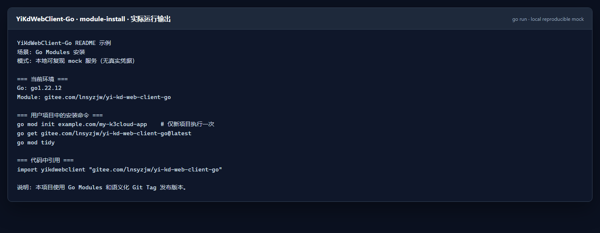

### 2.3 手动下载源码并本地引入（离线）

无法使用 `go get` 时，可以下载源码后本地引入，只需下面 4 步。

1. 下载 `v1.0.0` 源码 ZIP：

   - [从 Gitee 下载](https://gitee.com/lnsyzjw/yi-kd-web-client-go/repository/archive/v1.0.0.zip)
   - [从 GitHub 下载](https://github.com/1609676823/YiKdWebClient-Go/archive/refs/tags/v1.0.0.zip)

2. 解压后把文件夹改名为 `YiKdWebClient-Go`，放到自己项目的 `libs` 目录：

   ```text
   my-k3cloud-app/
   ├── go.mod
   ├── main.go
   └── libs/
       └── YiKdWebClient-Go/
           ├── go.mod
           ├── client.go
           └── ...
   ```

   请确认库自己的 `go.mod` 直接位于 `libs/YiKdWebClient-Go` 中，不要多套一层文件夹。

3. 在自己项目的 `go.mod` 末尾加入：

   ```go.mod
   require gitee.com/lnsyzjw/yi-kd-web-client-go v1.0.0

   replace gitee.com/lnsyzjw/yi-kd-web-client-go v1.0.0 => ./libs/YiKdWebClient-Go
   ```

4. 创建 `main.go`。虽然使用的是本地源码，导入路径仍然保持不变：

   ```go
   package main

   import (
       "fmt"

       yikdwebclient "gitee.com/lnsyzjw/yi-kd-web-client-go"
   )

   func main() {
       fmt.Println("YiKdWebClient-Go", yikdwebclient.Version)
   }
   ```

   整理依赖并运行：

   ```bash
   go mod tidy
   go run .
   ```

   看到 `YiKdWebClient-Go 1.0.0` 就表示引入成功。接下来可按第 3、4 节配置并调用金蝶 WebAPI。

本库只使用 Go 标准库，所以安装好 Go 1.22 或更高版本后，上述引入和编译过程不需要联网。实际调用金蝶 WebAPI 时，程序仍需能够访问目标金蝶服务地址。

### 2.4 Gitee 主仓库与 GitHub 镜像

`go.mod` 声明的规范模块路径是：

```text
gitee.com/lnsyzjw/yi-kd-web-client-go
```

因此，即使从 GitHub 查看或克隆代码，业务代码也不应改成 `github.com/1609676823/YiKdWebClient-Go` 导入路径。两个仓库会推送相同的提交和 Tag，GitHub 的职责是镜像和容灾。

中国大陆环境如果访问默认代理较慢，可在确认组织安全政策允许后配置自己信任的 Go Proxy，例如：

```bash
go env -w GOPROXY=https://goproxy.cn,direct
```

如果仅需在 Gitee 不可达时进行本地开发，也可以从 GitHub 克隆，再按第 2.3 节使用本地 `replace`。例如源码与业务项目位于同一目录时，将替换路径改成：

```go.mod
replace gitee.com/lnsyzjw/yi-kd-web-client-go v1.0.0 => ../YiKdWebClient-Go
```

`replace` 只在当前业务项目中生效。离线交付业务项目时，需要把它指向的本地源码目录一起交付。

## 3. 配置 appsettings.xml

### 3.1 创建本地配置

仓库提供无密钥模板：

```powershell
Copy-Item .\YiKdWebCfg\appsettings.example.xml .\YiKdWebCfg\appsettings.xml
```

Bash：

```bash
cp YiKdWebCfg/appsettings.example.xml YiKdWebCfg/appsettings.xml
```

`YiKdWebCfg/appsettings.xml` 和 `*.cnf` 已被 `.gitignore` 排除。请在自己的密钥管理或部署流程中提供真实值。

### 3.2 完整 XML 模板

```xml
<?xml version="1.0" encoding="utf-8"?>
<configuration>
  <appSettings>
    <!-- 请替换为真实数据中心 ID / 账套 ID -->
    <add key="X-KDApi-AcctID" value="YOUR_ACCOUNT_ID" />

    <!-- 请替换为真实集成用户 -->
    <add key="X-KDApi-UserName" value="Administrator" />

    <!-- 请替换为真实应用 ID -->
    <add key="X-KDApi-AppID" value="YOUR_APP_ID" />

    <!-- 请替换为真实应用密钥 -->
    <add key="X-KDApi-AppSec" value="123456" />

    <!-- 账套语系，简体中文通常为 2052 -->
    <add key="X-KDApi-LCID" value="2052" />

    <!-- 启用多组织时可填组织编码 -->
    <add key="X-KDApi-OrgNum" value="100" />

    <!-- 请替换为真实服务地址；私有云通常以 K3Cloud/ 结尾 -->
    <add key="X-KDApi-ServerUrl" value="http://127.0.0.1/K3Cloud/" />
  </appSettings>
</configuration>
```

### 3.3 配置项说明

| 配置项 | 是否常用 | 说明 |
| --- | --- | --- |
| `X-KDApi-AcctID` | 是 | 数据中心 ID，也称账套 ID。可在第三方系统登录授权页面生成测试链接后查看。 |
| `X-KDApi-UserName` | 是 | 集成用户。PT-146894 `[7.7.0.202111]` 及后续版本可使用指定用户登录列表中的用户；若授权允许全部用户登录，则不受该列表限制。 |
| `X-KDApi-AppID` | 是 | 第三方系统登录授权的应用 ID。 |
| `X-KDApi-AppSec` | 是 | 第三方系统登录授权的应用密钥。不要使用生产密钥运行公开示例。 |
| `X-KDApi-LCID` | 是 | 账套语系，默认值为 `2052`。 |
| `X-KDApi-OrgNum` | 否 | 多组织场景中的组织编码，主要用于签名认证模式。 |
| `X-KDApi-ServerUrl` | 是 | 私有云填写产品地址，并以 `K3Cloud/` 结尾；使用公有云网关时按官方要求配置。 |

### 3.4 私有云与公有云网关

私有云通常配置产品地址并以 `K3Cloud/` 结尾；部分公有云环境可能要求通过 `https://api.kingdee.com/galaxyapi/` 网关并使用 API 请求头签名。实际地址与认证规则应以目标环境和金蝶官方当前要求为准。各语言客户端均保留普通登录与 API 请求头签名能力。

> [!IMPORTANT]
> Go 不会像 C# `.csproj` 的 `CopyToOutputDirectory` 那样自动复制 XML。`NewClientFromConfig("YiKdWebCfg/appsettings.xml")` 的相对路径以程序当前工作目录为基准。部署时应显式带上配置文件、传入绝对路径，或从配置中心读取后组装 `AppSettingsModel`。不建议用 `go:embed` 将生产密钥编译进可执行文件。

## 4. 五分钟运行第一个示例

1. 安装 Go 1.22 或更高版本，确认 `go version` 可执行。
2. 按第 2 节初始化用户项目并执行 `go get`。
3. 在项目目录中创建 `YiKdWebCfg/appsettings.xml`，填入自己的测试环境。
4. 将下面的完整代码保存为 `main.go`。
5. 执行 `go run .`。

```go
package main

import (
	"fmt"
	"log"

	yikdwebclient "gitee.com/lnsyzjw/yi-kd-web-client-go"
)

func main() {
	client, err := yikdwebclient.NewClientFromConfig(
		"YiKdWebCfg/appsettings.xml",
		yikdwebclient.WithClientLoginType(yikdwebclient.LoginTypeSignSHA256),
	)
	if err != nil {
		log.Fatal(err)
	}
	defer client.Close()

	formID := "SEC_User"
	payload := `{
  "IsUserModelInit": "true",
  "Number": "Administrator",
  "IsSortBySeq": "false"
}`

	response, err := client.View(formID, payload)
	if err != nil {
		log.Fatalf("View 失败: %v\n服务端原始返回: %s", err, response)
	}

	loginRequestURL := client.ReturnLoginWebModel.RequestUrl
	loginRequestBody := client.ReturnLoginWebModel.RealRequestBody
	loginResponseBody := client.ReturnLoginWebModel.RealResponseBody
	operationRequestURL := client.ReturnOperationWebModel.RequestUrl
	operationRequestBody := client.ReturnOperationWebModel.RealRequestBody
	operationResponseBody := client.ReturnOperationWebModel.RealResponseBody

	fmt.Println("表单 ID（formID）：", formID)
	fmt.Println("业务 JSON 参数（payload）：", payload)
	fmt.Println("登录请求地址（loginRequestURL）：", loginRequestURL)
	fmt.Println("登录请求报文（loginRequestBody）：", loginRequestBody)
	fmt.Println("登录返回报文（loginResponseBody）：", loginResponseBody)
	fmt.Println("业务请求地址（operationRequestURL）：", operationRequestURL)
	fmt.Println("业务请求报文（operationRequestBody）：", operationRequestBody)
	fmt.Println("业务返回报文（operationResponseBody）：", operationResponseBody)
	fmt.Println("View 方法返回值（response）：", response)
}
```

## 5. README 可复现示例运行器

`examples/readme` 对齐 C# `ConsoleTestNet80` 的示例目录。默认模式会启动一个只绑定本机的临时 `httptest` 服务，创建临时 XML、CNF 和上传文件，然后通过库的真实 HTTP 发送链路运行。运行结束后临时文件会删除。

查看全部命令：

```bash
go run ./examples/readme help
```

运行一个无凭据示例：

```bash
go run ./examples/readme sign-sha256
```

| 命令 | 场景 |
| --- | --- |
| `module-install` | Go Modules 安装方式 |
| `sign-sha256` | SHA256 签名登录 + View |
| `sign-sha1` | SHA1 签名登录 + View |
| `app-secret` | AppSecret 登录 + View |
| `validate-login` | 明文密码验证登录 + View |
| `simple-passport` | CNF 简易账号本登录 + View |
| `api-sign-headers` | API Sign Headers + View |
| `dynamic-config` | 代码动态配置 |
| `custom-config-path` | 自定义 XML 路径 |
| `custom-webapi` | 自定义 WebAPI |
| `sso-v4` | SSO V4 URL |
| `upload-file` | 文件分块上传 |
| `upload-progress` | 上传进度回调 |
| `upload-base64` | Base64 分块上传 |
| `validate-user-endecode` | DES 加密密码验证登录 + View |

### 5.1 切换到自己的真实测试环境

PowerShell：

```powershell
$env:YIKD_EXAMPLE_MODE = "live"
$env:YIKD_CONFIG_PATH = "D:\secure\appsettings.xml"
$env:YIKD_VALIDATE_PASSWORD = "仅在当前进程中使用的测试密码"
$env:YIKD_CNF_PATH = "D:\secure\API测试.cnf"
$env:YIKD_UPLOAD_FILE = "D:\test-data\upload-demo.txt"

go run ./examples/readme sign-sha256
```

Bash：

```bash
export YIKD_EXAMPLE_MODE=live
export YIKD_CONFIG_PATH=/secure/appsettings.xml
export YIKD_VALIDATE_PASSWORD='仅限测试账号的密码'
export YIKD_CNF_PATH=/secure/API测试.cnf
export YIKD_UPLOAD_FILE=/test-data/upload-demo.txt

go run ./examples/readme sign-sha256
```

| 环境变量 | 用途 |
| --- | --- |
| `YIKD_EXAMPLE_MODE=live` | 显式开启真实环境模式；未设置时永远使用本地 mock |
| `YIKD_CONFIG_PATH` | XML 配置文件路径 |
| `YIKD_VALIDATE_DBID` | `ValidateLogin` 的账套 ID，未设置则用 XML 值 |
| `YIKD_VALIDATE_USERNAME` | 验证登录用户，未设置则用 XML 值 |
| `YIKD_VALIDATE_PASSWORD` | 验证登录密码；运行器输出会脱敏 |
| `YIKD_VALIDATE_LCID` | 验证登录语系，未设置则用 XML 值 |
| `YIKD_CNF_PATH` | Simple Passport 的真实 CNF 文件 |
| `YIKD_UPLOAD_FILE` | 上传示例的源文件 |
| `YIKD_UPLOAD_FORM_ID` | 附件表单 ID，默认 `SAL_SaleOrder` |
| `YIKD_UPLOAD_INTER_ID` | 单据内码，默认仅为示例值 |
| `YIKD_UPLOAD_BILL_NO` | 单据编号，默认仅为示例值 |
| `YIKD_UPLOAD_CHUNK_SIZE` | 分块字节数 |

> [!CAUTION]
> `View` 是读操作，上传、保存、审核、删除等会改变真实数据。只应在专用测试账套中运行真实模式。

## 6. 认证与请求示例

### 6.0 认证方式对照

Go 版与 C# `LoginType` 保持一致，共有 7 个枚举值：6 种可选认证模式，以及 1 种只为旧系统保留的兼容模式。

| C# `LoginType` | Go 常量 | 用途 | 是否先登录 | 建议 |
| --- | --- | --- | --- | --- |
| `LoginBySignSHA256` | `LoginTypeSignSHA256` | SHA256 签名信息认证 | 是 | 支持 SHA256 的环境优先使用 |
| `LoginBySignSHA1` | `LoginTypeSignSHA1` | SHA1 签名信息认证 | 是 | 仅用于兼容旧版本 |
| `LoginByAppSecret` | `LoginTypeAppSecret` | 第三方系统登录授权 | 是 | 按目标环境授权方式选择 |
| `LoginByApiSignHeaders` | `LoginTypeAPISignHeaders` | 每个业务请求独立生成 API 签名请求头 | 否 | 使用前确认目标环境/网关支持 |
| `ValidateLogin` | `LoginTypeValidateLogin` | 旧版用户名密码认证 | 是 | 旧系统兼容，不建议新系统优先使用 |
| `LoginBySimplePassport` | `LoginTypeSimplePassport` | CNF 文件或 Base64 集成密钥认证 | 是 | 集成密钥场景 |
| `ValidateUserEnDeCode` | `LoginTypeValidateUserCode` | 已弃用的旧式用户名密码编码兼容 | 是 | 仅保留旧场景兼容 |

「7 个枚举值」不等于 7 种推荐方案。新项目通常从 `LoginBySignSHA256`、`LoginByAppSecret` 或目标网关要求的 `LoginByApiSignHeaders` 中选择。

下面每个 Go 代码块都是独立、完整的 `main.go`，已安装 Module 并准备好配置后可直接复制运行。

### 6.1 SHA256 签名登录

SHA256 是新接入时的推荐签名模式。

```go
package main

import (
	"fmt"
	"log"

	yikdwebclient "gitee.com/lnsyzjw/yi-kd-web-client-go"
)

func main() {
	client, err := yikdwebclient.NewClientFromConfig(
		"YiKdWebCfg/appsettings.xml",
		yikdwebclient.WithClientLoginType(yikdwebclient.LoginTypeSignSHA256),
	)
	if err != nil {
		log.Fatal(err)
	}
	defer client.Close()

	formID := "SEC_User"
	payload := `{"IsUserModelInit":"true","Number":"Administrator","IsSortBySeq":"false"}`
	response, err := client.View(formID, payload)
	if err != nil {
		log.Fatalf("%v\n%s", err, response)
	}

	loginRequestURL := client.ReturnLoginWebModel.RequestUrl
	loginRequestBody := client.ReturnLoginWebModel.RealRequestBody
	loginResponseBody := client.ReturnLoginWebModel.RealResponseBody
	operationRequestURL := client.ReturnOperationWebModel.RequestUrl
	operationRequestBody := client.ReturnOperationWebModel.RealRequestBody
	operationResponseBody := client.ReturnOperationWebModel.RealResponseBody

	fmt.Println("表单 ID（formID）：", formID)
	fmt.Println("业务 JSON 参数（payload）：", payload)
	fmt.Println("登录请求地址（loginRequestURL）：", loginRequestURL)
	fmt.Println("登录请求报文（loginRequestBody）：", loginRequestBody)
	fmt.Println("登录返回报文（loginResponseBody）：", loginResponseBody)
	fmt.Println("业务请求地址（operationRequestURL）：", operationRequestURL)
	fmt.Println("业务请求报文（operationRequestBody）：", operationRequestBody)
	fmt.Println("业务返回报文（operationResponseBody）：", operationResponseBody)
	fmt.Println("View 方法返回值（response）：", response)
}
```

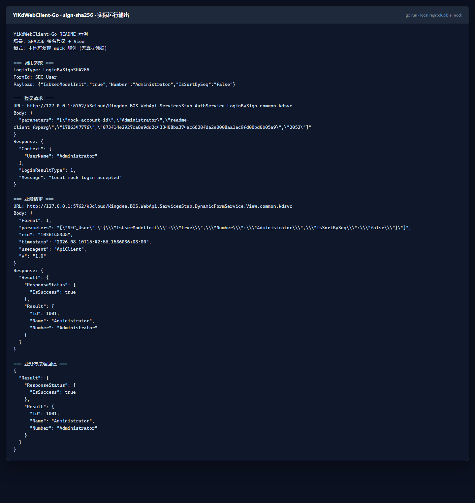

### 6.2 SHA1 签名登录

SHA1 只用于兼容要求该旧协议的金蝶环境。

```go
package main

import (
	"fmt"
	"log"

	yikdwebclient "gitee.com/lnsyzjw/yi-kd-web-client-go"
)

func main() {
	client, err := yikdwebclient.NewClientFromConfig(
		"YiKdWebCfg/appsettings.xml",
		yikdwebclient.WithClientLoginType(yikdwebclient.LoginTypeSignSHA1),
	)
	if err != nil {
		log.Fatal(err)
	}
	defer client.Close()

	formID := "SEC_User"
	payload := `{"IsUserModelInit":"true","Number":"Administrator","IsSortBySeq":"false"}`
	response, err := client.View(formID, payload)
	if err != nil {
		log.Fatalf("%v\n%s", err, response)
	}

	loginRequestURL := client.ReturnLoginWebModel.RequestUrl
	loginRequestBody := client.ReturnLoginWebModel.RealRequestBody
	loginResponseBody := client.ReturnLoginWebModel.RealResponseBody
	operationRequestURL := client.ReturnOperationWebModel.RequestUrl
	operationRequestBody := client.ReturnOperationWebModel.RealRequestBody
	operationResponseBody := client.ReturnOperationWebModel.RealResponseBody

	fmt.Println("表单 ID（formID）：", formID)
	fmt.Println("业务 JSON 参数（payload）：", payload)
	fmt.Println("登录请求地址（loginRequestURL）：", loginRequestURL)
	fmt.Println("登录请求报文（loginRequestBody）：", loginRequestBody)
	fmt.Println("登录返回报文（loginResponseBody）：", loginResponseBody)
	fmt.Println("业务请求地址（operationRequestURL）：", operationRequestURL)
	fmt.Println("业务请求报文（operationRequestBody）：", operationRequestBody)
	fmt.Println("业务返回报文（operationResponseBody）：", operationResponseBody)
	fmt.Println("View 方法返回值（response）：", response)
}
```

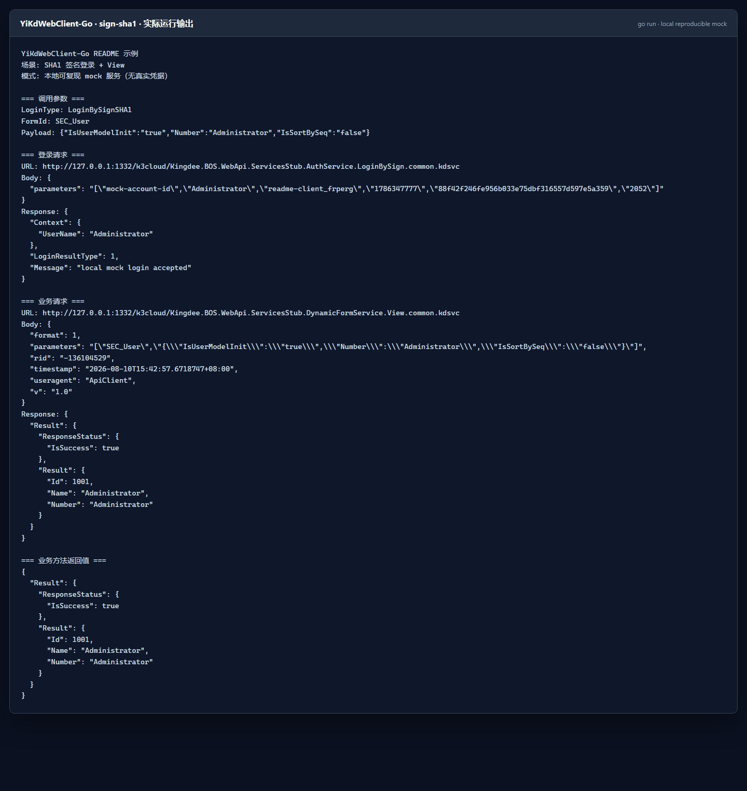

### 6.3 AppSecret 登录

`LoginTypeAppSecret` 也是 `NewClient` 的默认登录类型；下面仍显式传入，便于阅读和迁移。

```go
package main

import (
	"fmt"
	"log"

	yikdwebclient "gitee.com/lnsyzjw/yi-kd-web-client-go"
)

func main() {
	client, err := yikdwebclient.NewClientFromConfig(
		"YiKdWebCfg/appsettings.xml",
		yikdwebclient.WithClientLoginType(yikdwebclient.LoginTypeAppSecret),
	)
	if err != nil {
		log.Fatal(err)
	}
	defer client.Close()

	formID := "SEC_User"
	payload := `{"IsUserModelInit":"true","Number":"Administrator","IsSortBySeq":"false"}`
	response, err := client.View(formID, payload)
	if err != nil {
		log.Fatalf("%v\n%s", err, response)
	}

	loginRequestURL := client.ReturnLoginWebModel.RequestUrl
	loginRequestBody := client.ReturnLoginWebModel.RealRequestBody
	loginResponseBody := client.ReturnLoginWebModel.RealResponseBody
	operationRequestURL := client.ReturnOperationWebModel.RequestUrl
	operationRequestBody := client.ReturnOperationWebModel.RealRequestBody
	operationResponseBody := client.ReturnOperationWebModel.RealResponseBody

	fmt.Println("表单 ID（formID）：", formID)
	fmt.Println("业务 JSON 参数（payload）：", payload)
	fmt.Println("登录请求地址（loginRequestURL）：", loginRequestURL)
	fmt.Println("登录请求报文（loginRequestBody）：", loginRequestBody)
	fmt.Println("登录返回报文（loginResponseBody）：", loginResponseBody)
	fmt.Println("业务请求地址（operationRequestURL）：", operationRequestURL)
	fmt.Println("业务请求报文（operationRequestBody）：", operationRequestBody)
	fmt.Println("业务返回报文（operationResponseBody）：", operationResponseBody)
	fmt.Println("View 方法返回值（response）：", response)
}
```

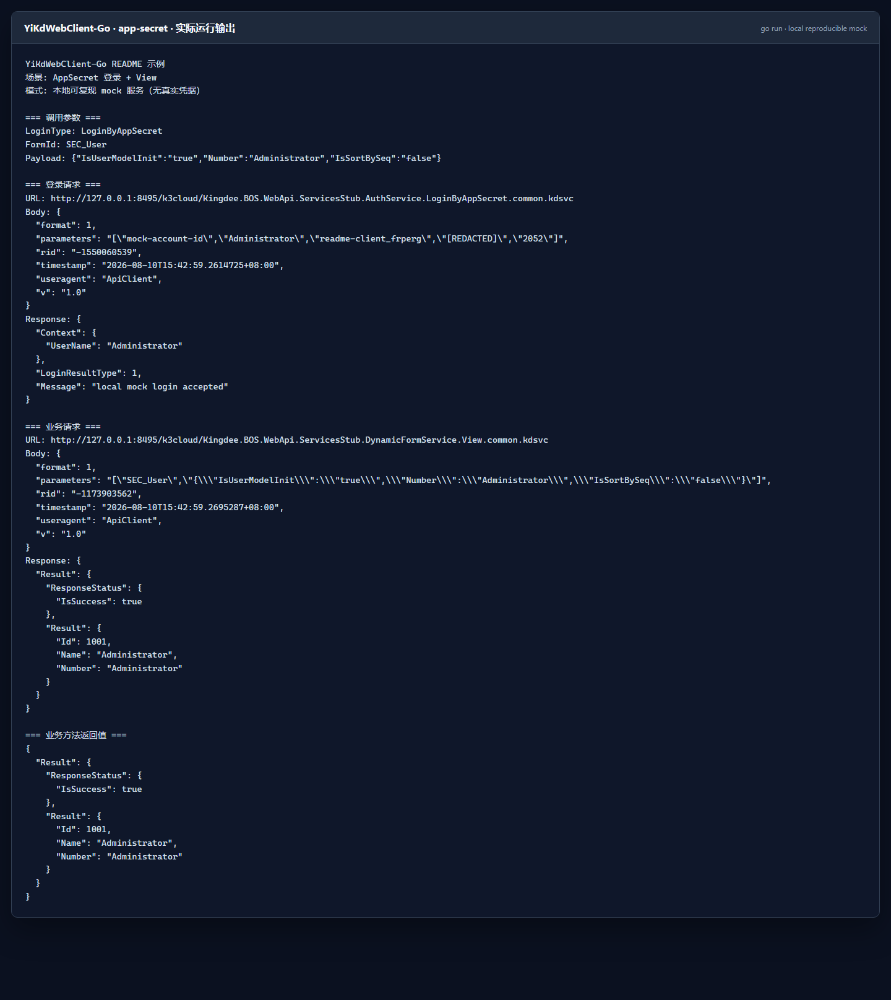

### 6.4 ValidateLogin 账号密码验证登录

下面使用 `123456` 作为密码占位值；复制后请替换成目标测试用户的真实密码。

```go
package main

import (
	"fmt"
	"log"

	yikdwebclient "gitee.com/lnsyzjw/yi-kd-web-client-go"
)

func main() {
	serverURL := "http://127.0.0.1/K3Cloud/" // 请替换为真实服务地址
	dataCenterID := "6979b9812f3f89" // 请替换为真实数据中心 ID
	userName := "demo" // 请替换为真实用户名
	password := "123456" // 请替换为目标测试用户的真实密码
	languageID := 2052 // 请按目标环境语系替换
	settings := &yikdwebclient.AppSettingsModel{XKDApiServerUrl: serverURL}

	client, err := yikdwebclient.NewClient(
		yikdwebclient.WithAppSettings(settings),
		yikdwebclient.WithClientLoginType(yikdwebclient.LoginTypeValidateLogin),
	)
	if err != nil {
		log.Fatal(err)
	}
	defer client.Close()

	client.ValidateLoginSettingsModel = &yikdwebclient.ValidateLoginSettingsModel{
		Url:      serverURL,
		DbId:     dataCenterID,
		UserName: userName,
		Password: password,
		Lcid:     languageID,
	}

	formID := "SEC_User"
	payload := `{"IsUserModelInit":"true","Number":"Administrator","IsSortBySeq":"false"}`
	response, err := client.View(formID, payload)
	if err != nil {
		log.Fatalf("%v\n%s", err, response)
	}

	loginRequestURL := client.ReturnLoginWebModel.RequestUrl
	loginRequestBody := client.ReturnLoginWebModel.RealRequestBody
	loginResponseBody := client.ReturnLoginWebModel.RealResponseBody
	operationRequestURL := client.ReturnOperationWebModel.RequestUrl
	operationRequestBody := client.ReturnOperationWebModel.RealRequestBody
	operationResponseBody := client.ReturnOperationWebModel.RealResponseBody

	fmt.Println("服务地址（serverURL）：", serverURL)
	fmt.Println("数据中心 ID（dataCenterID）：", dataCenterID)
	fmt.Println("用户名（userName）：", userName)
	fmt.Println("密码（password）：", password)
	fmt.Println("语系（languageID）：", languageID)
	fmt.Println("表单 ID（formID）：", formID)
	fmt.Println("业务 JSON 参数（payload）：", payload)
	fmt.Println("登录请求地址（loginRequestURL）：", loginRequestURL)
	fmt.Println("登录请求报文（loginRequestBody）：", loginRequestBody)
	fmt.Println("登录返回报文（loginResponseBody）：", loginResponseBody)
	fmt.Println("业务请求地址（operationRequestURL）：", operationRequestURL)
	fmt.Println("业务请求报文（operationRequestBody）：", operationRequestBody)
	fmt.Println("业务返回报文（operationResponseBody）：", operationResponseBody)
	fmt.Println("View 方法返回值（response）：", response)
}
```

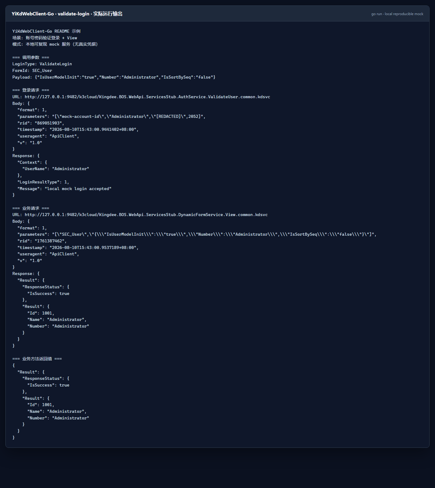

### 6.5 ValidateUserEnDeCode 加密密码验证登录

该模式为兼容旧协议保留。客户端会在内部对这里定义的用户名和密码执行协议要求的编码，不要在调用前重复编码。

```go
package main

import (
	"fmt"
	"log"

	yikdwebclient "gitee.com/lnsyzjw/yi-kd-web-client-go"
)

func main() {
	serverURL := "http://127.0.0.1/K3Cloud/" // 请替换为真实服务地址
	dataCenterID := "6979b9812f3f89" // 请替换为真实数据中心 ID
	userName := "demo" // 请替换为真实用户名
	password := "123456" // 请替换为目标测试用户的真实密码
	languageID := 2052 // 请按目标环境语系替换
	settings := &yikdwebclient.AppSettingsModel{XKDApiServerUrl: serverURL}

	client, err := yikdwebclient.NewClient(
		yikdwebclient.WithAppSettings(settings),
		yikdwebclient.WithClientLoginType(yikdwebclient.LoginTypeValidateUserCode),
	)
	if err != nil {
		log.Fatal(err)
	}
	defer client.Close()

	client.ValidateLoginSettingsModel = &yikdwebclient.ValidateLoginSettingsModel{
		Url:      serverURL,
		DbId:     dataCenterID,
		UserName: userName,
		Password: password,
		Lcid:     languageID,
	}

	formID := "SEC_User"
	payload := `{"IsUserModelInit":"true","Number":"Administrator","IsSortBySeq":"false"}`
	response, err := client.View(formID, payload)
	if err != nil {
		log.Fatalf("%v\n%s", err, response)
	}

	loginRequestURL := client.ReturnLoginWebModel.RequestUrl
	loginRequestBody := client.ReturnLoginWebModel.RealRequestBody
	loginResponseBody := client.ReturnLoginWebModel.RealResponseBody
	operationRequestURL := client.ReturnOperationWebModel.RequestUrl
	operationRequestBody := client.ReturnOperationWebModel.RealRequestBody
	operationResponseBody := client.ReturnOperationWebModel.RealResponseBody

	fmt.Println("服务地址（serverURL）：", serverURL)
	fmt.Println("数据中心 ID（dataCenterID）：", dataCenterID)
	fmt.Println("用户名（userName）：", userName)
	fmt.Println("密码（password）：", password)
	fmt.Println("语系（languageID）：", languageID)
	fmt.Println("表单 ID（formID）：", formID)
	fmt.Println("业务 JSON 参数（payload）：", payload)
	fmt.Println("登录请求地址（loginRequestURL）：", loginRequestURL)
	fmt.Println("登录请求报文（loginRequestBody）：", loginRequestBody)
	fmt.Println("登录返回报文（loginResponseBody）：", loginResponseBody)
	fmt.Println("业务请求地址（operationRequestURL）：", operationRequestURL)
	fmt.Println("业务请求报文（operationRequestBody）：", operationRequestBody)
	fmt.Println("业务返回报文（operationResponseBody）：", operationResponseBody)
	fmt.Println("View 方法返回值（response）：", response)
}
```

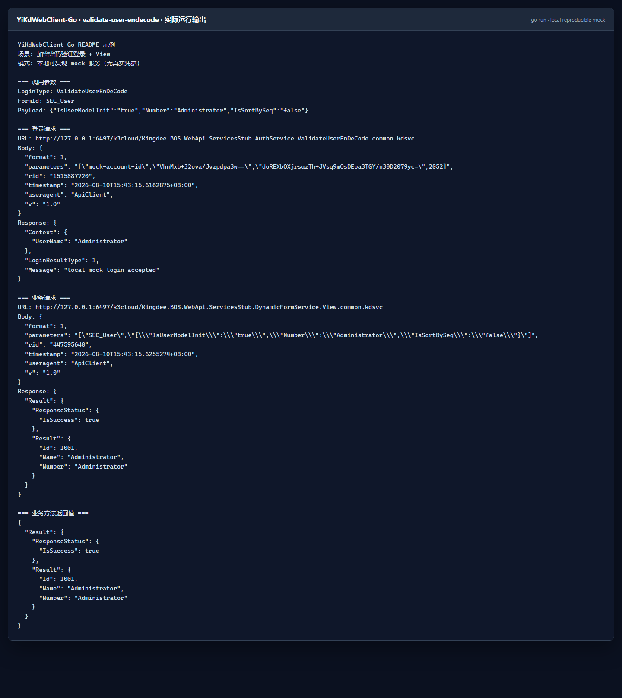

### 6.6 Simple Passport / CNF 登录

CNF 由金蝶环境生成，不是由 Go 客户端编译出来的资源，也不应随公开 Release 发布。

```go
package main

import (
	"fmt"
	"log"

	yikdwebclient "gitee.com/lnsyzjw/yi-kd-web-client-go"
)

func main() {
	serverURL := "http://127.0.0.1/K3Cloud/" // 请替换为真实服务地址
	cnfPath := "D:/secure/API测试.cnf" // 请替换为目标环境生成的真实 CNF 文件
	languageID := 2052 // 请按目标环境语系替换
	settings := &yikdwebclient.AppSettingsModel{XKDApiServerUrl: serverURL}

	client, err := yikdwebclient.NewClient(
		yikdwebclient.WithAppSettings(settings),
		yikdwebclient.WithClientLoginType(yikdwebclient.LoginTypeSimplePassport),
	)
	if err != nil {
		log.Fatal(err)
	}
	defer client.Close()

	client.LoginBySimplePassportModel = &yikdwebclient.LoginBySimplePassportModel{
		Url:                  serverURL,
		CnfFilePath:          cnfPath,
		Lcid:                 languageID,
		BySimplePassportType: yikdwebclient.SimplePassportCnfFile,
	}

	formID := "SEC_User"
	payload := `{"IsUserModelInit":"true","Number":"Administrator","IsSortBySeq":"false"}`
	response, err := client.View(formID, payload)
	if err != nil {
		log.Fatalf("%v\n%s", err, response)
	}

	loginRequestURL := client.ReturnLoginWebModel.RequestUrl
	loginRequestBody := client.ReturnLoginWebModel.RealRequestBody
	loginResponseBody := client.ReturnLoginWebModel.RealResponseBody
	operationRequestURL := client.ReturnOperationWebModel.RequestUrl
	operationRequestBody := client.ReturnOperationWebModel.RealRequestBody
	operationResponseBody := client.ReturnOperationWebModel.RealResponseBody

	fmt.Println("服务地址（serverURL）：", serverURL)
	fmt.Println("CNF 文件（cnfPath）：", cnfPath)
	fmt.Println("语系（languageID）：", languageID)
	fmt.Println("表单 ID（formID）：", formID)
	fmt.Println("业务 JSON 参数（payload）：", payload)
	fmt.Println("登录请求地址（loginRequestURL）：", loginRequestURL)
	fmt.Println("登录请求报文（loginRequestBody）：", loginRequestBody)
	fmt.Println("登录返回报文（loginResponseBody）：", loginResponseBody)
	fmt.Println("业务请求地址（operationRequestURL）：", operationRequestURL)
	fmt.Println("业务请求报文（operationRequestBody）：", operationRequestBody)
	fmt.Println("业务返回报文（operationResponseBody）：", operationResponseBody)
	fmt.Println("View 方法返回值（response）：", response)
}
```

如果已在安全配置中保存 CNF 的 Base64 值，可改为：

```go
base64Passport := "请替换为真实 CNF 的 Base64 内容" // 请替换为目标环境的真实值
client.LoginBySimplePassportModel = &yikdwebclient.LoginBySimplePassportModel{
	Url:                     serverURL,
	SimplePassportForBase64: base64Passport,
	Lcid:                    languageID,
	BySimplePassportType:    yikdwebclient.SimplePassportForBase64,
}
```

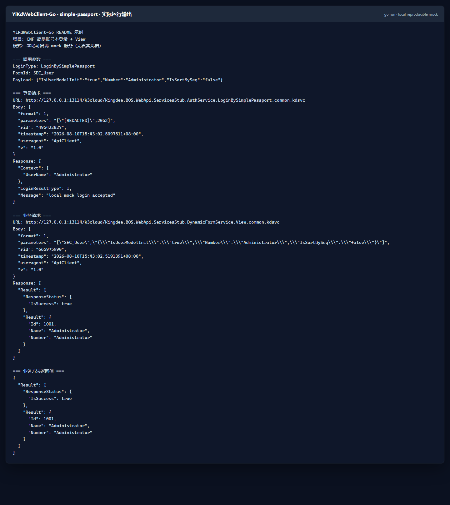

### 6.7 API 请求头签名

该模式不先建立 Cookie 登录会话，每次业务请求都会根据最终 URL 重新生成签名头。如果 `XKDApiAppID` 是 `ClientID_加密密钥` 格式，还会生成 API Sign v2 头。

```go
package main

import (
	"fmt"
	"log"

	yikdwebclient "gitee.com/lnsyzjw/yi-kd-web-client-go"
)

func main() {
	client, err := yikdwebclient.NewClientFromConfig(
		"YiKdWebCfg/appsettings.xml",
		yikdwebclient.WithClientLoginType(yikdwebclient.LoginTypeAPISignHeaders),
	)
	if err != nil {
		log.Fatal(err)
	}
	defer client.Close()

	formID := "SEC_User"
	payload := `{"IsUserModelInit":"true","Number":"Administrator","IsSortBySeq":"false"}`
	response, err := client.View(formID, payload)
	if err != nil {
		log.Fatalf("%v\n%s", err, response)
	}

	requestHeaders := client.RequestHeadersString
	operationRequestURL := client.ReturnOperationWebModel.RequestUrl
	operationRequestBody := client.ReturnOperationWebModel.RealRequestBody
	operationResponseBody := client.ReturnOperationWebModel.RealResponseBody

	fmt.Println("表单 ID（formID）：", formID)
	fmt.Println("业务 JSON 参数（payload）：", payload)
	fmt.Println("实际签名请求头（requestHeaders）：", requestHeaders)
	fmt.Println("业务请求地址（operationRequestURL）：", operationRequestURL)
	fmt.Println("业务请求报文（operationRequestBody）：", operationRequestBody)
	fmt.Println("业务返回报文（operationResponseBody）：", operationResponseBody)
	fmt.Println("View 方法返回值（response）：", response)
}
```

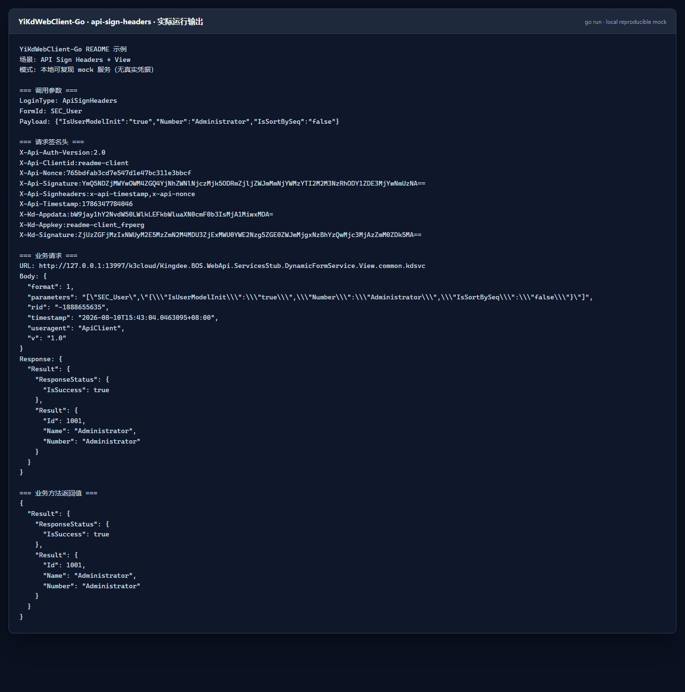

### 6.8 不使用 XML，在代码中动态配置

该方式适合容器、CI/CD 和统一密钥管理系统。

```go
package main

import (
	"fmt"
	"log"

	yikdwebclient "gitee.com/lnsyzjw/yi-kd-web-client-go"
)

func main() {
	dataCenterID := "替换为数据中心 ID" // 请替换为真实数据中心 ID
	appID := "替换为应用 ID" // 请替换为真实应用 ID
	appSecret := "123456" // 请替换为真实应用密钥
	userName := "Administrator" // 请替换为真实集成用户
	serverURL := "http://127.0.0.1/K3Cloud/" // 请替换为真实服务地址
	organizationNumber := "100" // 请替换为真实组织编码；不需要时留空
	languageID := "2052" // 请按目标环境语系替换

	settings := &yikdwebclient.AppSettingsModel{
		XKDApiAcctID:    dataCenterID,
		XKDApiAppID:     appID,
		XKDApiAppSec:    appSecret,
		XKDApiUserName:  userName,
		XKDApiLCID:      languageID,
		XKDApiServerUrl: serverURL,
		XKDApiOrgNum:    organizationNumber,
	}

	client, err := yikdwebclient.NewClient(
		yikdwebclient.WithAppSettings(settings),
		yikdwebclient.WithClientLoginType(yikdwebclient.LoginTypeSignSHA256),
	)
	if err != nil {
		log.Fatal(err)
	}
	defer client.Close()

	formID := "SEC_User"
	payload := `{"IsUserModelInit":"true","Number":"Administrator","IsSortBySeq":"false"}`
	response, err := client.View(formID, payload)
	if err != nil {
		log.Fatalf("%v\n%s", err, response)
	}

	loginRequestURL := client.ReturnLoginWebModel.RequestUrl
	loginRequestBody := client.ReturnLoginWebModel.RealRequestBody
	loginResponseBody := client.ReturnLoginWebModel.RealResponseBody
	operationRequestURL := client.ReturnOperationWebModel.RequestUrl
	operationRequestBody := client.ReturnOperationWebModel.RealRequestBody
	operationResponseBody := client.ReturnOperationWebModel.RealResponseBody

	fmt.Println("数据中心 ID：", settings.XKDApiAcctID)
	fmt.Println("集成用户：", settings.XKDApiUserName)
	fmt.Println("应用 ID：", settings.XKDApiAppID)
	fmt.Println("应用密钥：", settings.XKDApiAppSec)
	fmt.Println("语系：", settings.XKDApiLCID)
	fmt.Println("组织编码：", settings.XKDApiOrgNum)
	fmt.Println("服务地址：", settings.XKDApiServerUrl)
	fmt.Println("表单 ID（formID）：", formID)
	fmt.Println("业务 JSON 参数（payload）：", payload)
	fmt.Println("登录请求地址（loginRequestURL）：", loginRequestURL)
	fmt.Println("登录请求报文（loginRequestBody）：", loginRequestBody)
	fmt.Println("登录返回报文（loginResponseBody）：", loginResponseBody)
	fmt.Println("业务请求地址（operationRequestURL）：", operationRequestURL)
	fmt.Println("业务请求报文（operationRequestBody）：", operationRequestBody)
	fmt.Println("业务返回报文（operationResponseBody）：", operationResponseBody)
	fmt.Println("View 方法返回值（response）：", response)
}
```

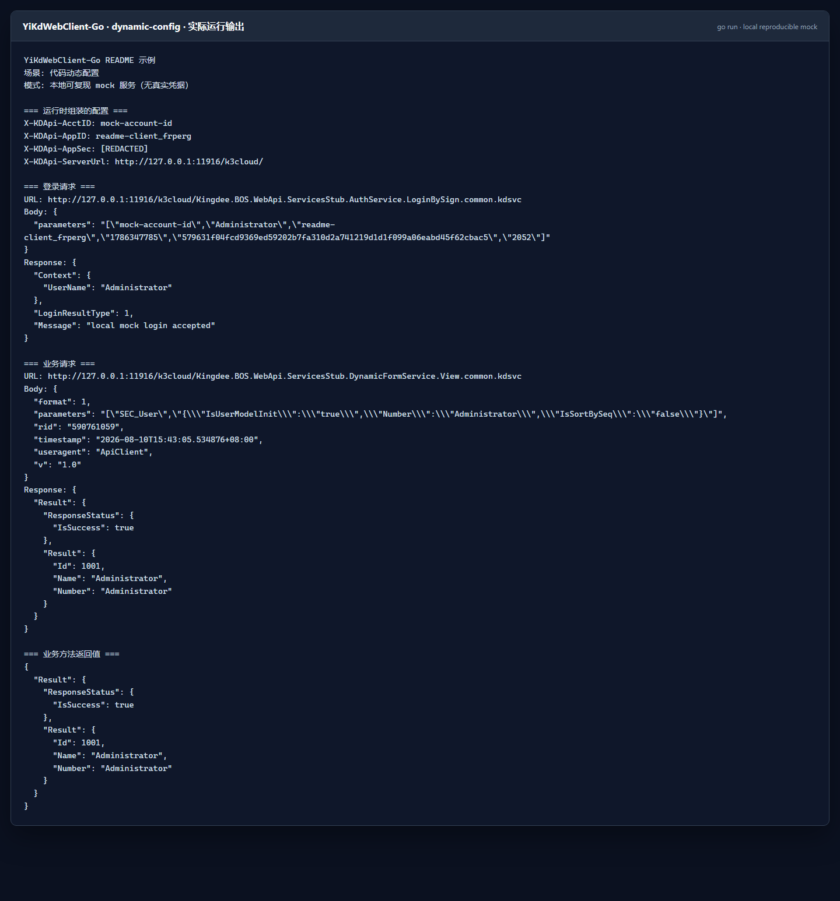

### 6.9 使用自定义 XML 配置路径

```go
package main

import (
	"flag"
	"fmt"
	"log"

	yikdwebclient "gitee.com/lnsyzjw/yi-kd-web-client-go"
)

func main() {
	configPath := flag.String("config", "YiKdWebCfg/appsettings.xml", "XML 配置文件路径")
	flag.Parse()

	client, err := yikdwebclient.NewClientFromConfig(
		*configPath,
		yikdwebclient.WithClientLoginType(yikdwebclient.LoginTypeSignSHA256),
	)
	if err != nil {
		log.Fatal(err)
	}
	defer client.Close()

	formID := "SEC_User"
	payload := `{"IsUserModelInit":"true","Number":"Administrator","IsSortBySeq":"false"}`
	response, err := client.View(formID, payload)
	if err != nil {
		log.Fatalf("%v\n%s", err, response)
	}

	loginRequestURL := client.ReturnLoginWebModel.RequestUrl
	loginRequestBody := client.ReturnLoginWebModel.RealRequestBody
	loginResponseBody := client.ReturnLoginWebModel.RealResponseBody
	operationRequestURL := client.ReturnOperationWebModel.RequestUrl
	operationRequestBody := client.ReturnOperationWebModel.RealRequestBody
	operationResponseBody := client.ReturnOperationWebModel.RealResponseBody

	fmt.Println("配置文件路径（configPath）：", *configPath)
	fmt.Println("表单 ID（formID）：", formID)
	fmt.Println("业务 JSON 参数（payload）：", payload)
	fmt.Println("登录请求地址（loginRequestURL）：", loginRequestURL)
	fmt.Println("登录请求报文（loginRequestBody）：", loginRequestBody)
	fmt.Println("登录返回报文（loginResponseBody）：", loginResponseBody)
	fmt.Println("业务请求地址（operationRequestURL）：", operationRequestURL)
	fmt.Println("业务请求报文（operationRequestBody）：", operationRequestBody)
	fmt.Println("业务返回报文（operationResponseBody）：", operationResponseBody)
	fmt.Println("View 方法返回值（response）：", response)
}
```

运行：

```bash
go run . -config /secure/yikd/appsettings.xml
```

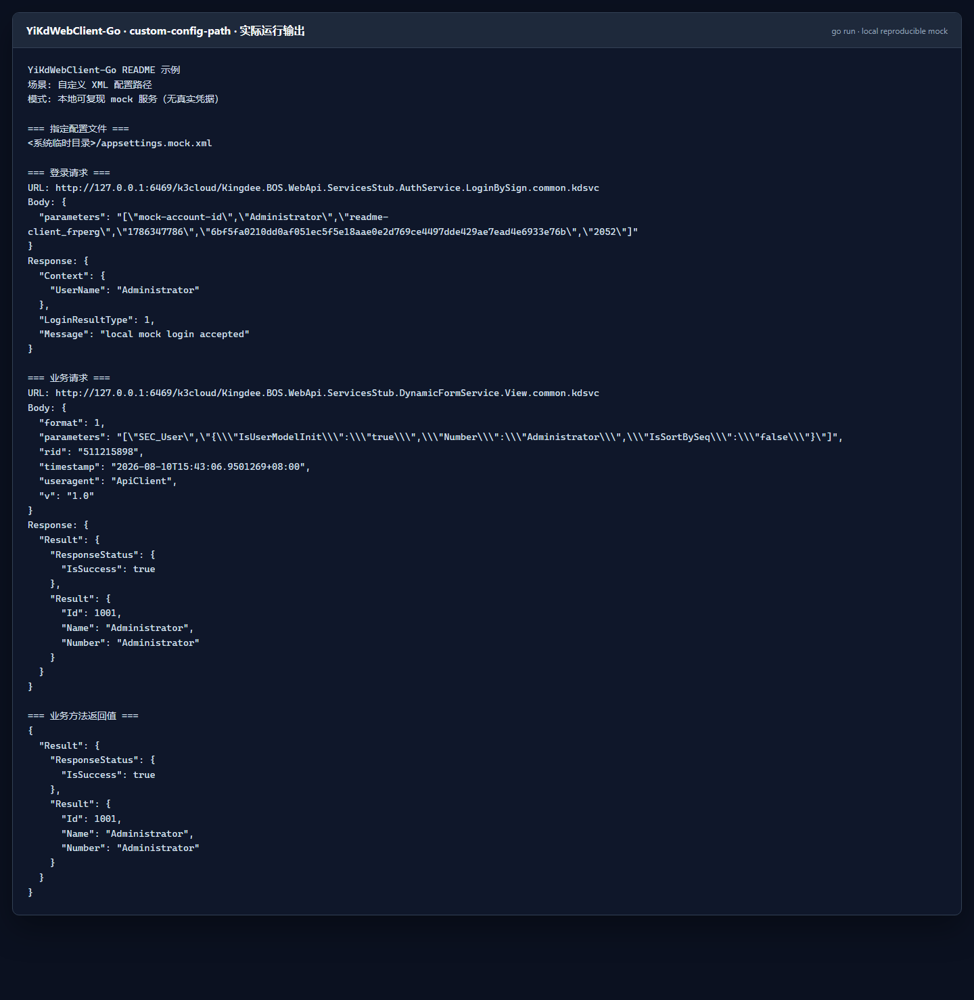

### 6.10 请求与返回诊断

下面是可独立运行的诊断示例，会完整输出当前示例生成的请求体、返回体和请求头。

```go
package main

import (
	"fmt"
	"log"

	yikdwebclient "gitee.com/lnsyzjw/yi-kd-web-client-go"
)

func printWebModel(title string, model *yikdwebclient.RequestWebModel) {
	fmt.Println("===", title, "===")
	fmt.Println("URL:", model.RequestUrl)
	fmt.Println("Body:", model.RealRequestBody)
	fmt.Println("Response:", model.RealResponseBody)
}

func main() {
	client, err := yikdwebclient.NewClientFromConfig(
		"YiKdWebCfg/appsettings.xml",
		yikdwebclient.WithClientLoginType(yikdwebclient.LoginTypeSignSHA256),
	)
	if err != nil {
		log.Fatal(err)
	}
	defer client.Close()

	formID := "SEC_User"
	payload := `{"IsUserModelInit":"true","Number":"Administrator","IsSortBySeq":"false"}`
	response, err := client.View(formID, payload)
	if err != nil {
		log.Printf("调用错误: %v", err)
	}
	fmt.Println("表单 ID（formID）：", formID)
	fmt.Println("业务 JSON 参数（payload）：", payload)
	printWebModel("登录请求", client.ReturnLoginWebModel)
	fmt.Println("请求头:", client.RequestHeadersString)
	printWebModel("业务请求", client.ReturnOperationWebModel)
	fmt.Println("方法返回值:", response)
}
```

## 7. JSON 参数与接口功能列表

### 7.1 JSON 是业务参数，客户端负责外层包装

标准动态表单方法接收官方文档中的业务 JSON，库内部再构造 `parameters`、`timestamp`、`rid` 等最终报文。下面以及 7.3～7.6 的短片段假定已经按第 4 节创建好 `client`，但每次请求仍会完整定义业务参数并输出本次真实报文：

```go
formID := "BD_Customer"
payload := `{"CreateOrgId":0,"Number":"CUST001","Id":"","IsSortBySeq":"false"}`
response, err := client.View(formID, payload)
if err != nil {
	log.Fatalf("%v\n%s", err, response)
}

fmt.Println("表单 ID（formID）：", formID)
fmt.Println("业务 JSON 参数（payload）：", payload)
fmt.Println("登录请求地址：", client.ReturnLoginWebModel.RequestUrl)
fmt.Println("登录请求报文：", client.ReturnLoginWebModel.RealRequestBody)
fmt.Println("登录返回报文：", client.ReturnLoginWebModel.RealResponseBody)
fmt.Println("业务请求地址：", client.ReturnOperationWebModel.RequestUrl)
fmt.Println("业务请求报文：", client.ReturnOperationWebModel.RealRequestBody)
fmt.Println("业务返回报文：", client.ReturnOperationWebModel.RealResponseBody)
fmt.Println("View 方法返回值（response）：", response)
```

不要在这个 JSON 外面自己再加一层 `parameters`，除非调用的是明确要求原始 JSON 的方法。

### 7.2 带 `FormId` 的标准接口

全部已封装接口按功能分组如下：

| 方法 | 用途 |
| --- | --- |
| `View` | 查看单据或基础资料 |
| `Save`、`BatchSave`、`Draft`、`GroupSave`、`FlexSave` | 保存、批量保存、暂存、分组保存、弹性域保存 |
| `Submit`、`Audit`、`UnAudit`、`Delete`、`GroupDelete` | 提交、审核、反审核、删除和分组删除 |
| `ExecuteOperation`、`Push`、`Allocate`、`CancelAllocate`、`CancelAssign`、`Disassembly` | 通用操作、下推、分配、取消和拆单 |
| `ExecuteBillQuery`、`GetSysReportData`、`QueryBusinessInfo`、`QueryGroupInfo` | 单据查询、报表和业务信息查询 |
| `SendMsg`、`SwitchOrg`、`WorkflowAudit` | 消息、组织切换和工作流审批 |
| `AttachmentUpLoad`、`AttachmentDownLoad`、`UploadFile` | 原始附件/文件服务接口 |
| `CustomBusinessService`、`CustomBusinessServiceByParameters` | 自定义 WebAPI |
| `GetDataCenterList` | 获取数据中心列表 |

下列方法签名均为：

```go
方法(formID, payload string, options ...CallOption) (string, error)
```

| Go 方法 | 主要用途 |
| --- | --- |
| `View` | 查看单据/基础资料 |
| `Save` | 保存 |
| `BatchSave` | 批量保存 |
| `Submit` | 提交 |
| `Audit` | 审核 |
| `UnAudit` | 反审核 |
| `Delete` | 删除 |
| `Draft` | 暂存 |
| `Allocate` | 分配 |
| `Push` | 下推 |
| `GroupSave` | 分组保存 |
| `FlexSave` | 弹性域保存 |
| `GetSysReportData` | 系统报表数据 |
| `CancelAllocate` | 取消分配 |
| `CancelAssign` | 取消指定 |
| `Disassembly` | 拆单 |

### 7.3 只带业务 JSON 的接口

下列方法签名均为：

```go
方法(payload string, options ...CallOption) (string, error)
```

- `ExecuteBillQuery`
- `SendMsg`
- `SwitchOrg`
- `WorkflowAudit`
- `GroupDelete`
- `QueryBusinessInfo`
- `QueryGroupInfo`

`ExecuteBillQuery` 示例：

```go
payload := `{
  "FormId": "BD_Customer",
  "FieldKeys": "FCUSTID,FNumber,FName",
  "FilterString": [],
  "OrderString": "",
  "TopRowCount": 10,
  "StartRow": 0,
  "Limit": 10
}`
response, err := client.ExecuteBillQuery(payload)
if err != nil {
	log.Fatalf("%v\n%s", err, response)
}

fmt.Println("业务 JSON 参数（payload）：", payload)
fmt.Println("登录请求地址：", client.ReturnLoginWebModel.RequestUrl)
fmt.Println("登录请求报文：", client.ReturnLoginWebModel.RealRequestBody)
fmt.Println("登录返回报文：", client.ReturnLoginWebModel.RealResponseBody)
fmt.Println("业务请求地址：", client.ReturnOperationWebModel.RequestUrl)
fmt.Println("业务请求报文：", client.ReturnOperationWebModel.RealRequestBody)
fmt.Println("业务返回报文：", client.ReturnOperationWebModel.RealResponseBody)
fmt.Println("ExecuteBillQuery 方法返回值（response）：", response)
```

### 7.4 通用操作与原始 JSON

`ExecuteOperation` 的参数顺序与 C# 主项目一致：`formID, opNumber, payload`。

```go
formID := "SAL_SaleOrder"
operationNumber := "Forbid"
payload := `{"CreateOrgId":0,"Numbers":["SAL0001"]}`
response, err := client.ExecuteOperation(formID, operationNumber, payload)
if err != nil {
	log.Fatalf("%v\n%s", err, response)
}

fmt.Println("表单 ID（formID）：", formID)
fmt.Println("操作编码（operationNumber）：", operationNumber)
fmt.Println("业务 JSON 参数（payload）：", payload)
fmt.Println("登录请求地址：", client.ReturnLoginWebModel.RequestUrl)
fmt.Println("登录请求报文：", client.ReturnLoginWebModel.RealRequestBody)
fmt.Println("登录返回报文：", client.ReturnLoginWebModel.RealResponseBody)
fmt.Println("业务请求地址：", client.ReturnOperationWebModel.RequestUrl)
fmt.Println("业务请求报文：", client.ReturnOperationWebModel.RealRequestBody)
fmt.Println("业务返回报文：", client.ReturnOperationWebModel.RealResponseBody)
fmt.Println("ExecuteOperation 方法返回值（response）：", response)
```

下列方法按服务端要求直接发送原始 JSON，不再套标准 `parameters` 包装：

- `AttachmentUpLoad`
- `AttachmentDownLoad`
- `UploadFile`
- `CustomBusinessServiceByParameters`
- `CustomBusinessServiceByParametersAndStubpath`

### 7.5 自动登录、自动登出与 Cookie 复用

业务方法默认每次自动登录且自动登出。Go 版用 `CallOption` 代替 C# 的可选布尔参数：

```go
formID := "BD_Customer"
payload := `{"CreateOrgId":0,"Number":"CUST001","Id":"","IsSortBySeq":"false"}`
response, err := client.View(
	formID,
	payload,
	yikdwebclient.WithAutoLogout(false),
)
if err != nil {
	log.Fatalf("%v\n%s", err, response)
}

if err := client.Logout(); err != nil {
	log.Print(err)
}

fmt.Println("表单 ID（formID）：", formID)
fmt.Println("业务 JSON 参数（payload）：", payload)
fmt.Println("登录请求地址：", client.ReturnLoginWebModel.RequestUrl)
fmt.Println("登录请求报文：", client.ReturnLoginWebModel.RealRequestBody)
fmt.Println("登录返回报文：", client.ReturnLoginWebModel.RealResponseBody)
fmt.Println("业务请求地址：", client.ReturnOperationWebModel.RequestUrl)
fmt.Println("业务请求报文：", client.ReturnOperationWebModel.RealRequestBody)
fmt.Println("业务返回报文：", client.ReturnOperationWebModel.RealResponseBody)
fmt.Println("View 方法返回值（response）：", response)
```

需要在同一 Cookie 会话中连续调用时：

```go
loginExchange, err := client.Login()
if err != nil {
	log.Fatal(err)
}

options := []yikdwebclient.CallOption{
	yikdwebclient.WithAutoLogin(false),
	yikdwebclient.WithAutoLogout(false),
}

customerFormID := "BD_Customer"
customerPayload := `{"CreateOrgId":0,"Number":"CUST001","Id":"","IsSortBySeq":"false"}`
customerResponse, err := client.View(customerFormID, customerPayload, options...)
if err != nil {
	log.Fatalf("%v\n%s", err, customerResponse)
}
customerRequestURL := client.ReturnOperationWebModel.RequestUrl
customerRequestBody := client.ReturnOperationWebModel.RealRequestBody
customerResponseBody := client.ReturnOperationWebModel.RealResponseBody

materialFormID := "BD_MATERIAL"
materialPayload := `{"CreateOrgId":0,"Number":"MATERIAL001","Id":"","IsSortBySeq":"false"}`
materialResponse, err := client.View(materialFormID, materialPayload, options...)
if err != nil {
	log.Fatalf("%v\n%s", err, materialResponse)
}
materialRequestURL := client.ReturnOperationWebModel.RequestUrl
materialRequestBody := client.ReturnOperationWebModel.RealRequestBody
materialResponseBody := client.ReturnOperationWebModel.RealResponseBody

if err := client.Logout(); err != nil {
	log.Print(err)
}

fmt.Println("登录请求地址：", loginExchange.RequestUrl)
fmt.Println("登录请求报文：", loginExchange.RealRequestBody)
fmt.Println("登录返回报文：", loginExchange.RealResponseBody)
fmt.Println("客户表单 ID：", customerFormID)
fmt.Println("客户业务 JSON：", customerPayload)
fmt.Println("客户业务请求地址：", customerRequestURL)
fmt.Println("客户业务请求报文：", customerRequestBody)
fmt.Println("客户业务返回报文：", customerResponseBody)
fmt.Println("客户 View 返回值：", customerResponse)
fmt.Println("物料表单 ID：", materialFormID)
fmt.Println("物料业务 JSON：", materialPayload)
fmt.Println("物料业务请求地址：", materialRequestURL)
fmt.Println("物料业务请求报文：", materialRequestBody)
fmt.Println("物料业务返回报文：", materialResponseBody)
fmt.Println("物料 View 返回值：", materialResponse)
```

`Close` 仅关闭 Go 客户端对象的后续使用，不代替服务端 `Logout`。

### 7.6 Context、超时和自定义 HTTP Client

```go
client, err := yikdwebclient.NewClient(
	yikdwebclient.WithAppSettings(settings),
	yikdwebclient.WithClientTimeout(30*time.Second),
	yikdwebclient.WithHTTPClient(&http.Client{
		Transport: customTransport,
	}),
)
```

需要取消或截止时间时，使用 Context 版本：

- `LoginContext`
- `LogoutContext`
- `ExecAPIDynamicFormServiceContext`
- `ExecuteOperationContext`
- `GetDataCenterListContext`
- `WebHelper.SendHttpRequestContext`
- `WebHelperServices.SendHttpRequestContext`

```go
ctx, cancel := context.WithTimeout(context.Background(), 10*time.Second)
defer cancel()

formID := "SAL_SaleOrder"
operationNumber := "Forbid"
payload := `{"CreateOrgId":0,"Numbers":["SAL0001"]}`
response, err := client.ExecuteOperationContext(
	ctx,
	formID,
	operationNumber,
	payload,
)
if err != nil {
	log.Fatalf("%v\n%s", err, response)
}

fmt.Println("表单 ID：", formID)
fmt.Println("操作编码：", operationNumber)
fmt.Println("业务 JSON 参数：", payload)
fmt.Println("登录请求地址：", client.ReturnLoginWebModel.RequestUrl)
fmt.Println("登录请求报文：", client.ReturnLoginWebModel.RealRequestBody)
fmt.Println("登录返回报文：", client.ReturnLoginWebModel.RealResponseBody)
fmt.Println("业务请求地址：", client.ReturnOperationWebModel.RequestUrl)
fmt.Println("业务请求报文：", client.ReturnOperationWebModel.RealRequestBody)
fmt.Println("业务返回报文：", client.ReturnOperationWebModel.RealResponseBody)
fmt.Println("ExecuteOperationContext 方法返回值：", response)
```

### 7.7 错误类型

Go 方法返回 `(string, error)`。当服务端已返回原始业务正文时，`string` 仍尽可能保留，方便排查。

| 错误 | 说明 |
| --- | --- |
| `*HTTPError` | 非 2xx HTTP 返回，保留 `StatusCode` 和 `Body` |
| `*LoginError` | 登录报文被服务端拒绝；可用 `errors.Is(err, ErrLoginFailed)` |
| `*UploadResponseError` | 附件返回不可解析或 `IsSuccess` 不是成功 |
| `context.Canceled` / `context.DeadlineExceeded` | 调用被取消或超时 |

## 8. 单点登录 SSO

`SSOHelper` 支持 V1～V4。生成 URL 是本地签名计算，不会自动打开浏览器；使用者将目标 URL 交给自己的 Web 或桌面客户端。

```go
package main

import (
	"fmt"
	"log"

	yikdwebclient "gitee.com/lnsyzjw/yi-kd-web-client-go"
)

func main() {
	settings, err := yikdwebclient.LoadAppSettings("YiKdWebCfg/appsettings.xml")
	if err != nil {
		log.Fatal(err)
	}

	helper := yikdwebclient.NewSSOHelper(settings)
	helper.PermitCount = "1"

	urls, err := helper.GetSSOURLsV4(settings.XKDApiUserName, "")
	if err != nil {
		log.Fatal(err)
	}

	dataCenterID := helper.SimplePassportLoginArg.DbID
	appID := helper.SimplePassportLoginArg.AppID
	loginUserName := helper.SimplePassportLoginArg.Username
	timestamp := helper.Timestamp
	signedData := helper.SimplePassportLoginArg.SignedData
	argumentJSON := helper.ArgJSON
	argumentBase64 := helper.ArgJSONBase64
	html5URL := urls.HTML5URL
	wpfURL := urls.WPFURL
	silverlightURL := urls.SilverlightURL

	fmt.Println("数据中心 ID（dataCenterID）：", dataCenterID)
	fmt.Println("应用 ID（appID）：", appID)
	fmt.Println("登录用户名（loginUserName）：", loginUserName)
	fmt.Println("时间戳（timestamp）：", timestamp)
	fmt.Println("签名（signedData）：", signedData)
	fmt.Println("原始 SSO 参数 JSON（argumentJSON）：", argumentJSON)
	fmt.Println("Base64 参数（argumentBase64）：", argumentBase64)
	fmt.Println("HTML5 入口（html5URL）：", html5URL)
	fmt.Println("WPF 入口（wpfURL）：", wpfURL)
	fmt.Println("Silverlight 入口（silverlightURL）：", silverlightURL)
}
```

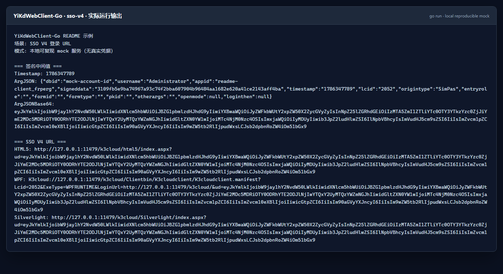

其他版本：

```go
v3, err := helper.GetSSOURLsV3(userName, "")
if err != nil {
	log.Fatal(err)
}
v2, err := helper.GetSSOURLsV2(userName, "")
if err != nil {
	log.Fatal(err)
}
v1, err := helper.GetSSOURLsV1(userName, "")
if err != nil {
	log.Fatal(err)
}

fmt.Println("V3 HTML5 入口：", v3.HTML5URL)
fmt.Println("V2 HTML5 入口：", v2.HTML5URL)
fmt.Println("V1 HTML5 入口：", v1.HTML5URL)
```

生成并执行 V4 退出：

```go
logout, err := helper.GetSSOLogoutAP0V4(userName, "")
if err != nil {
	log.Fatal(err)
}
logoutResponse, err := helper.SSOExecuteLogout(*logout)
if err != nil {
	log.Fatal(err)
}

fmt.Println("登出用户名：", userName)
fmt.Println("登出地址：", logout.RequestLogoutURL)
fmt.Println("登出请求参数 ap0：", logout.AP0)
fmt.Println("登出响应：", logoutResponse)
```

SSO URL 包含可用于登录的签名参数，不应记录到公开日志、分析系统或工单截图中。

## 9. 自定义 WebAPI

金蝶官方自定义 WebAPI 说明：<https://vip.kingdee.com/article/97030089581136896?specialId=448928749460099072&productLineId=1&isKnowledge=2&lang=zh-CN>

### 9.1 Go 客户端完整调用代码

目标 K3Cloud 环境必须已经部署与命名空间、类名和方法名一致的服务端插件。

客户端提供两类调用：`CustomBusinessService` 由客户端完成标准外层参数包装；`CustomBusinessServiceByParameters` 将调用者准备的 JSON 作为原始请求体发送。服务路径既可直接传字符串，也可通过 `CustomServicesStubpath` 生成；Go 中结构化路径对应 `CustomBusinessServiceByStubpath` 和 `CustomBusinessServiceByParametersAndStubpath`，定位值必须与服务端部署内容完全一致。

```go
package main

import (
	"encoding/json"
	"fmt"
	"log"

	yikdwebclient "gitee.com/lnsyzjw/yi-kd-web-client-go"
)

func main() {
	client, err := yikdwebclient.NewClientFromConfig(
		"YiKdWebCfg/appsettings.xml",
		yikdwebclient.WithClientLoginType(yikdwebclient.LoginTypeSignSHA256),
	)
	if err != nil {
		log.Fatal(err)
	}
	defer client.Close()

	stub := yikdwebclient.CustomServicesStubpath{
		ProjetNamespace:   "GlobalServiceCustom.WebApi",
		ProjetClassName:   "DataServiceHandler",
		ProjetClassMethod: "CommonRunnerService",
	}

	// 只应向受控服务端传递参数化、已授权的业务请求。
	request := struct {
		Parameters []string `json:"parameters"`
	}{
		Parameters: []string{"SELECT TOP 10 FID,FNUMBER FROM T_SEC_USER"},
	}
	payload, err := json.Marshal(request)
	if err != nil {
		log.Fatal(err)
	}

	response, err := client.CustomBusinessServiceByParametersAndStubpath(string(payload), stub)
	if err != nil {
		log.Fatalf("%v\n%s", err, response)
	}

	loginRequestURL := client.ReturnLoginWebModel.RequestUrl
	loginRequestBody := client.ReturnLoginWebModel.RealRequestBody
	loginResponseBody := client.ReturnLoginWebModel.RealResponseBody
	operationRequestURL := client.ReturnOperationWebModel.RequestUrl
	operationRequestBody := client.ReturnOperationWebModel.RealRequestBody
	operationResponseBody := client.ReturnOperationWebModel.RealResponseBody

	fmt.Println("服务路径：", stub.GetCustomServicesStubpathURL())
	fmt.Println("接口参数 JSON（payload）：", string(payload))
	fmt.Println("登录请求地址（loginRequestURL）：", loginRequestURL)
	fmt.Println("登录请求报文（loginRequestBody）：", loginRequestBody)
	fmt.Println("登录返回报文（loginResponseBody）：", loginResponseBody)
	fmt.Println("业务请求地址（operationRequestURL）：", operationRequestURL)
	fmt.Println("业务请求报文（operationRequestBody）：", operationRequestBody)
	fmt.Println("业务返回报文（operationResponseBody）：", operationResponseBody)
	fmt.Println("自定义接口返回值（response）：", response)
}
```

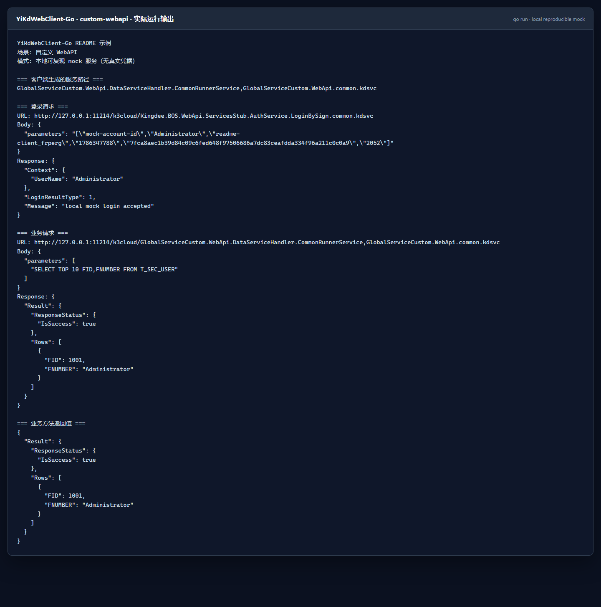

### 9.2 服务端 C# DLL 与 Go Module 是两件事

调用链路是：

```text
Go 业务程序
  -> YiKdWebClient-Go 发送 HTTP
  -> K3Cloud *.common.kdsvc 端点
  -> 服务器中已部署的 GlobalServiceCustom.WebApi.dll
  -> 自定义服务逻辑
```

Go 移植的是**客户端**，不会把 C# 服务端插件改写成 Go，也不会在 `go build` 时生成 `GlobalServiceCustom.WebApi.dll`。C# 主项目的服务端示例仍需通过 .NET Framework 4.8 编译，其 `kdbin` 中的下列 DLL 仅用于**编译时引用**：

- `Kingdee.BOS.dll`
- `Kingdee.BOS.ServiceFacade.KDServiceFx.dll`
- `Kingdee.BOS.ServiceHelper.dll`
- `Kingdee.BOS.WebApi.ServicesStub.dll`
- `Newtonsoft.Json.dll`

这些金蝶运行时 DLL 应从**目标金蝶环境的同版本**取得，用于编译兼容的自定义插件；不要将仓库 `kdbin` 里的文件覆盖到服务器。真正部署到金蝶服务器的是 C# 项目生成的：

```text
GlobalServiceCustom.WebApi.dll
```

PDB 是可选的调试符号文件。上述服务端 DLL 都不是 Go Module Release 的一部分，Go 用户只需确认目标 K3Cloud 环境已正确部署自定义服务。

> [!CAUTION]
> 不要将任意用户输入直接拼接到 SQL 中。服务端必须实施身份授权、参数校验、最小数据库权限和审计。

## 10. 文件与 Base64 分块上传

官方附件上传报文结构与原理：<https://vip.kingdee.com/article/296577252589190400?productLineId=1&isKnowledge=2&lang=zh-CN>

附件上传会写入目标业务系统。接入前必须替换真实的表单 ID、单据内码和单据编号，并确认目标环境已配置附件或对象存储。高层封装支持文件路径、分块进度回调和 Base64 数据；每个成功分块返回的 `FileId` 会自动写回上传模型。

### 10.1 从文件路径分块上传

`AttachmentUploadByFilePath` 流式读取文件，不会一次将整个文件读入内存。

```go
package main

import (
	"fmt"
	"log"

	yikdwebclient "gitee.com/lnsyzjw/yi-kd-web-client-go"
)

func main() {
	client, err := yikdwebclient.NewClientFromConfig(
		"YiKdWebCfg/appsettings.xml",
		yikdwebclient.WithClientLoginType(yikdwebclient.LoginTypeSignSHA256),
	)
	if err != nil {
		log.Fatal(err)
	}
	defer client.Close()

	template := yikdwebclient.NewUploadModel()
	template.Data.FormId = "SAL_SaleOrder"
	template.Data.InterId = "100001"
	template.Data.BillNO = "SAL000001"

	response, err := yikdwebclient.AttachmentUploadByFilePath(
		"test-data/upload-demo.txt",
		client,
		template,
		yikdwebclient.DefaultChunkSize,
		nil,
	)
	if err != nil {
		log.Fatalf("%v\n%s", err, response)
	}

	fmt.Println("待上传文件：", "test-data/upload-demo.txt")
	fmt.Println("目标表单：", template.Data.FormId)
	fmt.Println("单据内码：", template.Data.InterId)
	fmt.Println("单据编号：", template.Data.BillNO)
	fmt.Println("分块大小：", yikdwebclient.DefaultChunkSize)
	fmt.Println("登录请求地址：", client.ReturnLoginWebModel.RequestUrl)
	fmt.Println("登录请求报文：", client.ReturnLoginWebModel.RealRequestBody)
	fmt.Println("登录返回报文：", client.ReturnLoginWebModel.RealResponseBody)
	fmt.Println("最后一块请求地址：", client.ReturnOperationWebModel.RequestUrl)
	fmt.Println("最后一块请求报文：", client.ReturnOperationWebModel.RealRequestBody)
	fmt.Println("最后一块返回报文：", client.ReturnOperationWebModel.RealResponseBody)
	fmt.Println("上传方法返回值：", response)
}
```

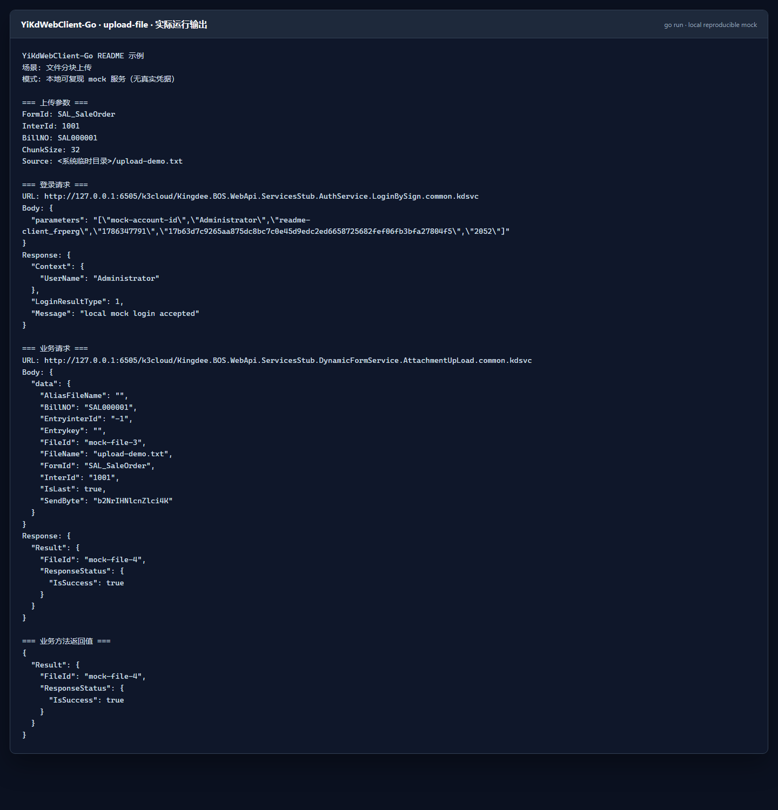

### 10.2 获取每个成功分块的进度

```go
package main

import (
	"fmt"
	"log"

	yikdwebclient "gitee.com/lnsyzjw/yi-kd-web-client-go"
)

func main() {
	client, err := yikdwebclient.NewClientFromConfig(
		"YiKdWebCfg/appsettings.xml",
		yikdwebclient.WithClientLoginType(yikdwebclient.LoginTypeSignSHA256),
	)
	if err != nil {
		log.Fatal(err)
	}
	defer client.Close()

	template := yikdwebclient.NewUploadModel()
	template.Data.FormId = "SAL_SaleOrder"
	template.Data.InterId = "100001"
	template.Data.BillNO = "SAL000001"

	var uploaded int64
	progress := func(
		chunk *yikdwebclient.FileChunk,
		_ *yikdwebclient.YiK3CloudClient,
	) error {
		uploaded += int64(len(chunk.Chunkbyte))
		fmt.Printf("chunk=%d bytes=%d uploaded=%d last=%t\n",
			chunk.Chunkindex, len(chunk.Chunkbyte), uploaded, chunk.IsLast)
		return nil
	}

	response, err := yikdwebclient.AttachmentUploadByFilePath(
		"test-data/upload-demo.txt",
		client,
		template,
		1024*1024,
		progress,
	)
	if err != nil {
		log.Fatalf("%v\n%s", err, response)
	}

	fmt.Println("待上传文件：", "test-data/upload-demo.txt")
	fmt.Println("目标表单：", template.Data.FormId)
	fmt.Println("单据内码：", template.Data.InterId)
	fmt.Println("单据编号：", template.Data.BillNO)
	fmt.Println("分块大小：", 1024*1024)
	fmt.Println("登录请求地址：", client.ReturnLoginWebModel.RequestUrl)
	fmt.Println("登录请求报文：", client.ReturnLoginWebModel.RealRequestBody)
	fmt.Println("登录返回报文：", client.ReturnLoginWebModel.RealResponseBody)
	fmt.Println("最后一块请求地址：", client.ReturnOperationWebModel.RequestUrl)
	fmt.Println("最后一块请求报文：", client.ReturnOperationWebModel.RealRequestBody)
	fmt.Println("最后一块返回报文：", client.ReturnOperationWebModel.RealResponseBody)
	fmt.Println("上传方法返回值：", response)
}
```

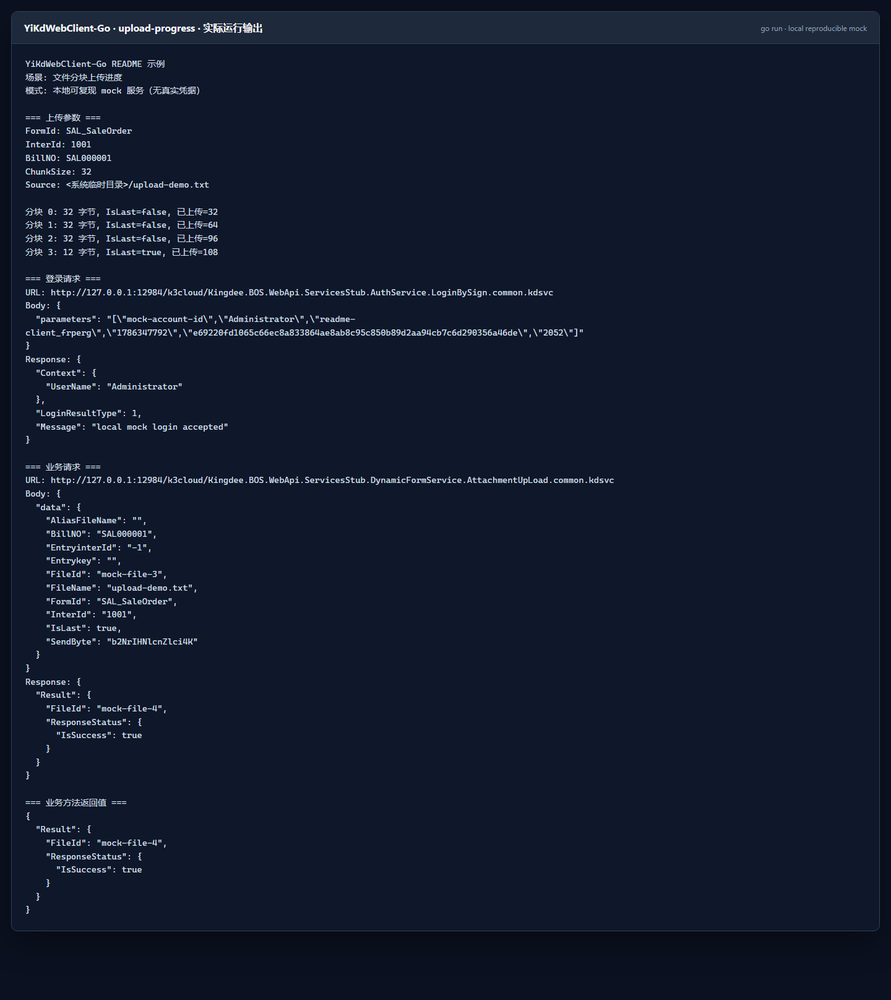

### 10.3 Base64 数据分块上传

`AttachmentUploadByBase64` 适合上游系统已经提供 Base64 的场景。如果原始数据本来就是本地文件，应优先使用文件路径版，避免额外的内存和 Base64 体积开销。

```go
package main

import (
	"encoding/base64"
	"fmt"
	"log"
	"os"

	yikdwebclient "gitee.com/lnsyzjw/yi-kd-web-client-go"
)

func main() {
	client, err := yikdwebclient.NewClientFromConfig(
		"YiKdWebCfg/appsettings.xml",
		yikdwebclient.WithClientLoginType(yikdwebclient.LoginTypeSignSHA256),
	)
	if err != nil {
		log.Fatal(err)
	}
	defer client.Close()

	data, err := os.ReadFile("test-data/upload-demo.txt")
	if err != nil {
		log.Fatal(err)
	}
	base64Data := base64.StdEncoding.EncodeToString(data)

	template := yikdwebclient.NewUploadModel()
	template.Data.FormId = "SAL_SaleOrder"
	template.Data.InterId = "100001"
	template.Data.BillNO = "SAL000001"

	response, err := yikdwebclient.AttachmentUploadByBase64(
		base64Data,
		"upload-demo.txt",
		client,
		template,
		yikdwebclient.DefaultChunkSize,
		nil,
	)
	if err != nil {
		log.Fatalf("%v\n%s", err, response)
	}

	fmt.Println("源文件：", "test-data/upload-demo.txt")
	fmt.Println("Base64 字符数：", len(base64Data))
	fmt.Println("目标表单：", template.Data.FormId)
	fmt.Println("单据内码：", template.Data.InterId)
	fmt.Println("单据编号：", template.Data.BillNO)
	fmt.Println("分块大小：", yikdwebclient.DefaultChunkSize)
	fmt.Println("登录请求地址：", client.ReturnLoginWebModel.RequestUrl)
	fmt.Println("登录请求报文：", client.ReturnLoginWebModel.RealRequestBody)
	fmt.Println("登录返回报文：", client.ReturnLoginWebModel.RealResponseBody)
	fmt.Println("最后一块请求地址：", client.ReturnOperationWebModel.RequestUrl)
	fmt.Println("最后一块请求报文：", client.ReturnOperationWebModel.RealRequestBody)
	fmt.Println("最后一块返回报文：", client.ReturnOperationWebModel.RealResponseBody)
	fmt.Println("上传方法返回值：", response)
}
```

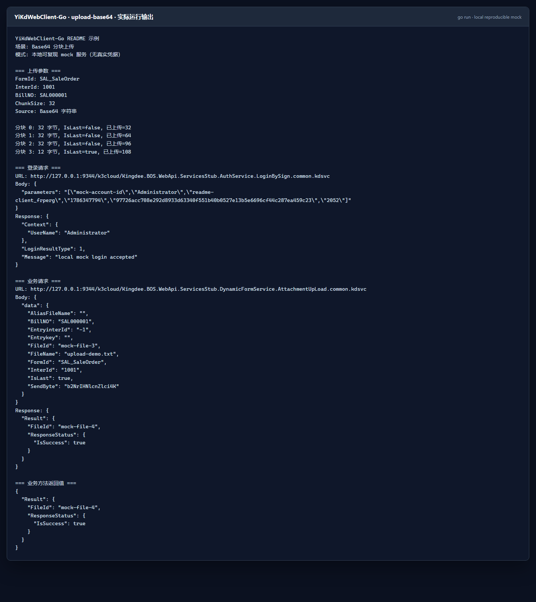

### 10.4 `UploadModel` 字段用途

| 字段 | 用途 |
| --- | --- |
| `FileName` | 当前附件文件名，高层封装会按源文件填充 |
| `FormId` | 单据或表单 ID |
| `InterId` | 单据内码 |
| `Entrykey` | 单据体标识；表头附件留空 |
| `EntryinterId` | 单据体内码；表头附件通常使用默认值 `-1` |
| `BillNO` | 单据编号 |
| `AliasFileName` | 可选的附件别名 |
| `FileId` | 服务端返回的文件 ID，每个成功分块后自动更新 |
| `SendByte` | 当前分块的 Base64 内容，高层封装自动填充 |
| `IsLast` | 是否为最后一块，高层封装自动填充 |

底层分块与校验方法：

- `ReadFileInChunksByAction`
- `ReadBase64ChunksByAction`
- `CheckUploadModelData`

## 11. 发布、Release 资源与仓库文件职责

### 11.1 使用者真正依赖的是什么

Go 用户执行：

```bash
go get gitee.com/lnsyzjw/yi-kd-web-client-go@v1.0.0
```

Go 工具链根据 Git Tag 下载模块源码，读取 `go.mod`，再将被用户代码导入的包编译进用户自己的可执行文件。对客户端库而言：

- **必需**：正确的 `go.mod`、根包 `.go` 源码、可达的 Git 提交和语义化 Tag。
- **建议随源码提供**：`README.md`、`LICENSE`、`CHANGELOG.md`、公开 API 文档。
- **无需单独提供**：Windows DLL、Linux `.so`、macOS `.dylib` 或预编译的 Go 客户端库。
- **可选**：Gitee/GitHub Release 页面、自动生成的源码 zip/tar.gz、发布说明和校验和。`go get` 不读取 Release Assets。
- **通常不应发布**：真实 XML、CNF、密钥、密码、Cookie、业务附件或作者本机截图中的私密数据。

Git 托管平台的「创建 Release」页面对 Go Module **不是必须步骤**。对 Go 工具链真正必须的是 Tag 已推送且 Tag 指向完整源码。但建议仍在两个平台上用同一 Tag 创建 Release，便于人类用户阅读更新说明。

### 11.2 仓库文件与目录是做什么的

| 文件/目录 | 主要使用者 | 作用 | 业务运行时是否需单独部署 |
| --- | --- | --- | --- |
| `go.mod` | Go 工具链、所有用户 | 声明模块路径和最低 Go 版本 | 否，`go get` 自动获取 |
| 根目录 `*.go` | Go 编译器、库用户 | 客户端、认证、HTTP、SSO、附件和模型实现 | 否，编译进用户程序 |
| `version.go` | 库用户、维护者 | 暴露 Go 版本和 C# 移植基准 | 否 |
| `YiKdWebCfg/appsettings.example.xml` | 库用户 | 无真实密钥的 XML 模板 | 模板不需；如选择 XML，需自行部署真实配置 |
| `examples/basic` | 初次使用者 | 最小查询示例 | 否 |
| `examples/readme` | 文档维护者、读者 | 15 个可复现场景、本地 mock、真实环境入口 | 否 |
| `docs/screenshots` | README 读者 | 由示例真实输出生成的文档图片 | 否 |
| `docs/API_MAPPING.md` | 迁移用户 | C# / Go 方法与差异对照 | 否 |
| `docs/RELEASE.md` | 维护者 | Tag、验证和发布流程 | 否 |
| `build-release.ps1` / `.bat` | 维护者 | 执行 gofmt 检查、vet、test、module 验证 | 否 |
| `.github/workflows/ci.yml` | GitHub Actions | Windows/Linux 多 Go 版本 CI | 否 |
| `*_test.go` | 维护者、CI | 本地 HTTP 回归测试，无真实金蝶凭据 | 否 |
| `CHANGELOG.md` | 所有用户 | 版本变更记录 | 否 |
| `LICENSE` | 所有用户 | MIT 许可条款 | 随源码分发，不是运行时资源 |

### 11.3 运行时可能需要的外部资源

| 资源 | 什么时候需要 | 如何使用 | 是否进入 Go Release |
| --- | --- | --- | --- |
| `appsettings.xml` | 选择 XML 配置时 | 传给 `NewClientFromConfig(path)` | 否，每个部署环境自行安全提供 |
| CNF 文件 | `LoginTypeSimplePassport` + `SimplePassportCnfFile` | 将安全路径赋给 `CnfFilePath` | 否，它是凭据 |
| CNF Base64 | `SimplePassportForBase64` | 从密钥管理系统读取到 `SimplePassportForBase64` | 否，它仍是凭据 |
| 待上传文件 | 调用附件上传时 | 传给 `AttachmentUploadByFilePath` | 否，它是用户业务数据 |
| 自定义 WebAPI DLL | 调用自定义服务时 | 由金蝶管理员部署到 K3Cloud 服务端 | 否，属于服务端 C# 项目 |
| 根 CA/客户端证书 | 目标环境 HTTPS 策略要求时 | 通过操作系统证书库或自定义 `http.Transport` 提供 | 通常否，由部署平台管理 |

### 11.4 维护者发布一个 Go 版本

1. 更新 `version.go` 中的 `Version`、C# 基准变更时同步更新 `CSharpSourceVersion`。
2. 更新 `CHANGELOG.md` 和 README。
3. 运行发布检查：

   ```powershell
   .\build-release.bat
   ```

4. 确认工作区只包含计划发布的内容，且没有真实凭据：

   ```bash
   git status --short
   git diff --check
   ```

5. 提交并创建带注释的语义化 Tag：

   ```bash
   git add .
   git commit -m "release: v1.0.0"
   git tag -a v1.0.0 -m "YiKdWebClient-Go v1.0.0"
   ```

6. 推送分支和 Tag：

   ```bash
   git push origin master
   git push origin v1.0.0
   ```

7. 在空目录中做安装冒烟测试：

   ```bash
   go mod init example.com/yikd-smoke-test
   go get gitee.com/lnsyzjw/yi-kd-web-client-go@v1.0.0
   go list -m all
   ```

8. 可选：在 Gitee 和 GitHub 用同一 Tag 创建 Release 页面，复制 `CHANGELOG.md` 对应版本的说明。无需上传预编译库。

`v2.0.0` 及以后是 Go Module 的破坏性主版本，需将 `go.mod` 的模块路径改为 `gitee.com/lnsyzjw/yi-kd-web-client-go/v2`，用户的导入路径也同步增加 `/v2`。不得只打 `v2.0.0` Tag 而不修改 Module 路径。

## 12. 兼容性、依赖与从 C# 迁移

### 12.1 Go 版本与平台

- `go.mod` 最低版本：Go 1.22。
- CI 验证：Go 1.22.x 和当前新版 Go，Windows 与 Linux。
- 依赖：只使用 Go 标准库，没有第三方 Module。
- 编译形式：源码随使用者项目编译，不需要 CGO，不需要金蝶官方 SDK。
- 行为基准：C# YiKdWebClient `1.0.0.32`。

### 12.2 从 C# 迁移时的主要差异

1. C# 返回 `string` 或通过异常表达失败；Go 返回 `(string, error)`。
2. C# 的可选 `AutoLogin` / `AutoLogout` 参数改为 `CallOption`。
3. Go 没有静态类，`CommonFunctionHelper`、`JsonHelperServices`、`EnDecode` 的相应方法映射为包级函数。
4. `.NET CookieContainer` / `CookieManager` 映射为 `http.CookieJar`。
5. `.NET TimeSpan` / `Duration` 映射为 `time.Duration`。
6. Go 的初始缩写使用 `URL` / `JSON` / `API`；为常用 C# 拼写保留了少量兼容别名。
7. Go 没有 `IDisposable` / `using`，创建客户端后使用 `defer client.Close()`。
8. Go 不自动复制 XML 到构建输出目录，应由部署流程管理配置。

完整方法对照见 [`docs/API_MAPPING.md`](docs/API_MAPPING.md)。

### 12.3 并发使用

`YiK3CloudClient` 保留最近一次登录/业务报文、Cookie、请求头和登录配置，是有状态对象。不要在请求进行中修改它，也不建议多个 goroutine 无保护地共享同一客户端。并发业务建议按会话/工作单元创建独立客户端，或在业务层用同步机制保护一个客户端。

## 13. 常见问题

### 13.1 为什么不需要单独下载客户端 DLL？

Go 的库标准分发单元是带 `go.mod` 的 Git 源码 Tag。`go get` 获取源码，`go build` 将它编译进使用者程序。不需要另外下载客户端 DLL。

### 13.2 `go get ...@v1.0.0` 提示 unknown revision 怎么办？

先确认维护者已将 `v1.0.0` Tag 推送到 Gitee：

```bash
git ls-remote --tags https://gitee.com/lnsyzjw/yi-kd-web-client-go.git
```

如果还没有稳定 Tag，可在评估风险后临时使用 `@latest` 或指定提交；生产项目建议回到明确 Tag。

### 13.3 能否直接 `go get github.com/1609676823/YiKdWebClient-Go`？

不建议。GitHub 是镜像，模块内声明的路径是 Gitee，Go 导入路径必须与 `go.mod` 一致。请使用 `gitee.com/lnsyzjw/yi-kd-web-client-go`。

### 13.4 能否不带 `appsettings.xml`？

可以。直接创建 `AppSettingsModel`，再通过 `WithAppSettings` 传入。这也是容器和云部署的推荐方式。

### 13.5 为什么构建后找不到 XML？

Go 不会根据文件名自动复制资源。相对路径按进程当前工作目录解析，不一定是可执行文件所在目录。请在部署脚本中复制 XML、显式传入路径，或改用动态配置。

### 13.6 CNF 需要在本项目中编译或 Release 吗？

不需要。CNF 是金蝶环境生成的集成凭据，只在 Simple Passport 登录运行时读取。它必须在使用者自己的安全配置中管理，不能进入公开源码或 Release Assets。

### 13.7 为什么仓库可能没有 `go.sum`？

当前库只使用 Go 标准库，`go.mod` 中没有第三方 `require`，因此不一定生成 `go.sum`。这不表示 Module 不完整。

### 13.8 HTTP 200 为什么业务仍失败？

金蝶 WebAPI 可能在 HTTP 200 正文中返回业务错误。请检查 `LoginResultType`、`ResponseStatus.IsSuccess`、`ErrorCode`、`Message` 和 `Errors`，并查看客户端保留的实际报文。

### 13.9 公有云与私有云地址如何选？

私有云通常是以 `K3Cloud/` 结尾的产品地址；公有云是否要求网关和 API Sign 会随金蝶产品与环境策略变化。应以目标环境管理员和当前官方文档为准，不要盲目复制 README 中的示例域名。

### 13.10 自定义 WebAPI 调用 404 怎么办？

确认服务端 DLL 已部署到正确 K3Cloud 环境，命名空间、类名、公开方法名和程序集名与 `CustomServicesStubpath` 一致，并检查 `GetCustomServicesStubpathURL()` 生成的 `.common.kdsvc` 路径。

### 13.11 返回登录失败如何排查？

依次检查服务地址与数据中心是否匹配、集成用户是否在授权范围内、应用 ID 与密钥是否成对、语系与组织编码是否适用、客户端与服务器时间是否准确，以及 CNF 是否由同一目标环境生成。旧版用户名密码登录还必须显式、安全地提供密码。

### 13.12 上传返回存储配置错误怎么办？

这通常表示请求已到达附件接口，但服务端没有正确配置附件或对象存储，或示例中的表单、单据内码和编号不存在。请先完成服务端配置，再替换为目标环境中的真实参数。

## 14. 开发、测试与项目地址

### 14.1 本地质量检查

```bash
go fmt ./...
go vet ./...
go test -cover ./...
```

Windows 上可直接执行：

```powershell
.\build-release.bat
```

测试使用 `httptest` 本地回环服务器，不需要真实金蝶环境，也不会向外部业务服务发送请求。

### 14.2 项目地址

- C# Gitee：<https://gitee.com/lnsyzjw/yi-kd-web-client>
- C# GitHub：<https://github.com/1609676823/YiKdWebClient>
- Java Gitee：<https://gitee.com/lnsyzjw/yi-kd-web-client-java>
- Java GitHub：<https://github.com/1609676823/YiKdWebClient-Java>
- Python Gitee：<https://gitee.com/lnsyzjw/yi-kd-web-client-python>
- Python GitHub：<https://github.com/1609676823/YiKdWebClient-Python>
- Go Gitee：<https://gitee.com/lnsyzjw/yi-kd-web-client-go>
- Go GitHub：<https://github.com/1609676823/YiKdWebClient-Go>
- PHP Gitee：<https://gitee.com/lnsyzjw/yi-kd-web-client-php>
- PHP GitHub：<https://github.com/1609676823/YiKdWebClient-PHP>

贡献前请阅读 [`CONTRIBUTING.md`](CONTRIBUTING.md)和 [`SECURITY.md`](SECURITY.md)。提交问题时请包含 Go 版本、金蝶产品/补丁版本、登录类型、脱敏后的实际 URL/报文和可复现步骤。

业务请求的 HTTP 状态成功不等于金蝶业务成功。请继续检查返回 JSON 中的 `LoginResultType`、`ResponseStatus.IsSuccess`、`ErrorCode` 和 `Message`。

克隆本仓库的开发者也可直接运行既有基础示例：

```bash
go run ./examples/basic -config YiKdWebCfg/appsettings.xml
```
